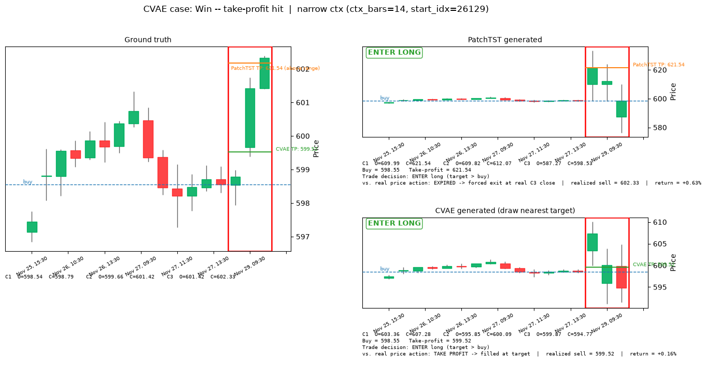
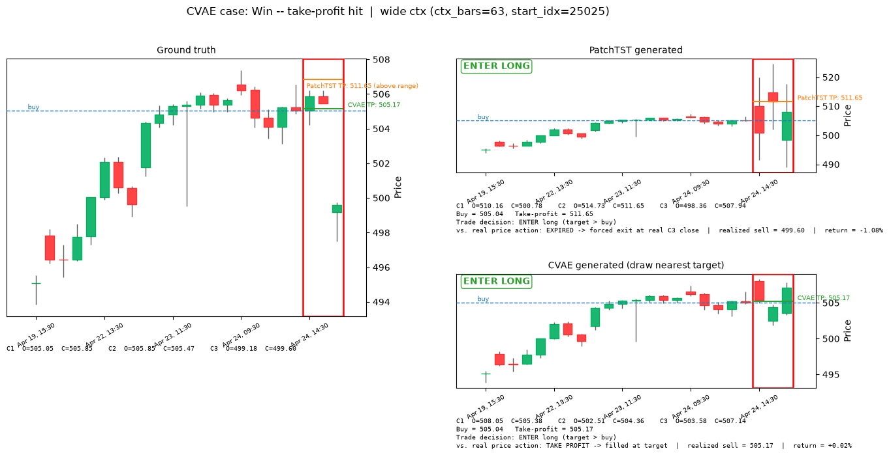
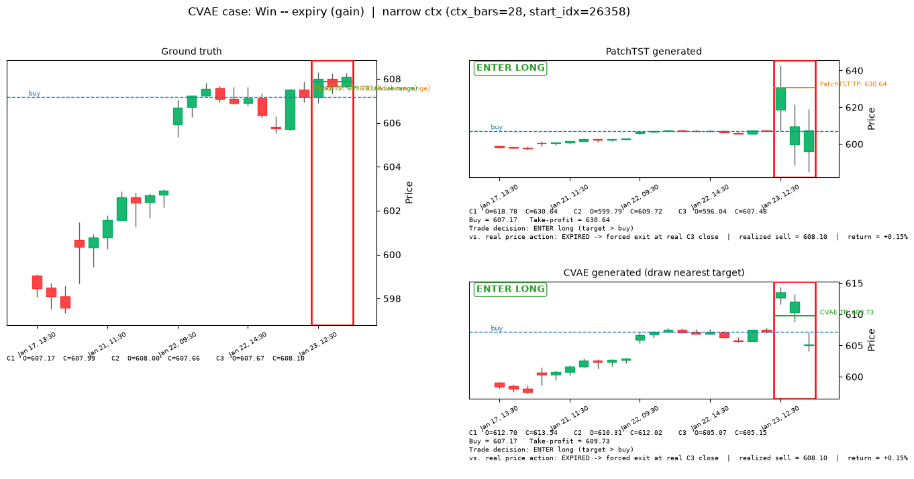
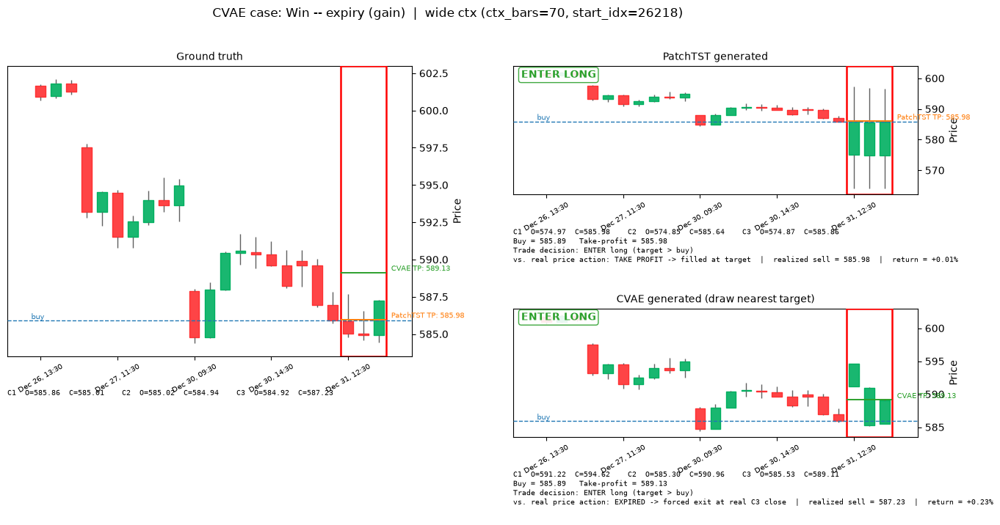
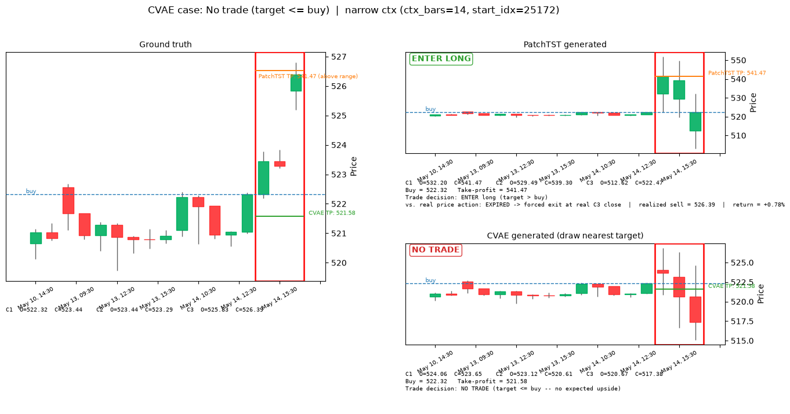
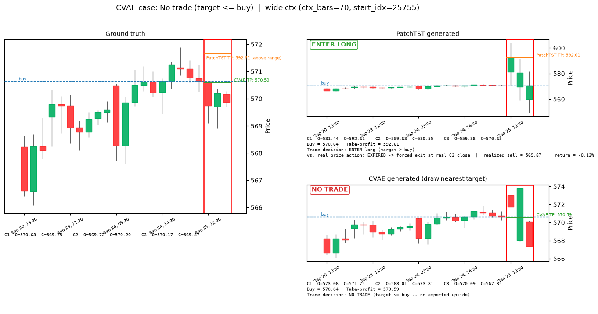
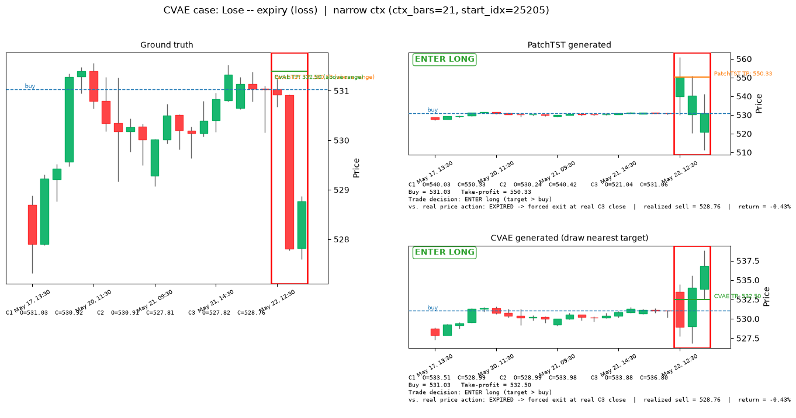
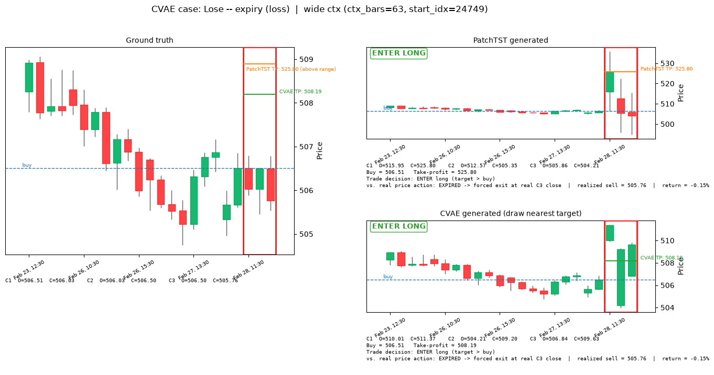

# v1 — SPY Intraday Candle Generation: PatchTST vs CVAE Inpainting

*This project uses some trading vocabulary (candles, buy/sell, backtest, etc.). If any of that's new to
you, check the "Key terms" section below before the rest — everything after it assumes you've read it.*

## Motivation / inspiration

A candlestick chart is drawn as a shape you read at a glance, not a number you look up: how big was the
move, did price close near its high or its low, how does this candle compare to the last few. That's the
frame this project builds around — instead of a model that only predicts a single future number (like
"price will be $558.20"), we want a model that generates a whole future *candle*, the same object a
person actually looks at on a chart.

The way we turned "generate a candle" into a machine learning problem borrows an idea from image
generation: **inpainting**. An image inpainting model fills in a missing, masked-out patch of pixels. We
do the same thing to a price chart — hide the last 3 hourly candles (zero them out, like a masked patch
of an image) and ask the model to generate a plausible completion. This gets us two things a single
predicted number can't: (1) the model's output is naturally a candle (open/high/low/close), not just a
number, and (2) because it's a *generative* model, we can ask it to generate several different plausible
completions for the same input and see whether they agree with each other. If 5 generated futures all say
"price goes up," that's a far more useful confidence signal than any single number could be.

**Data**: 27,007 hourly SPY (S&P 500 ETF) price bars, 2010-01-04 to 2025-05-30, market hours only
(`steven/ingest_spy_ohlcv.py`).

## Key terms

Skip this if you already know trading vocabulary — everything below assumes these definitions.

- **Candle / bar**: one time period's price summary, as 4 numbers — **open** (price at the start),
  **close** (price at the end), **high** / **low** (highest / lowest price reached during that period).
  Drawn as a thick box (the **body**, spanning open→close) with thin lines above/below (the **wicks**,
  showing the high/low). Green = price rose that period (close > open); red = it fell.
- **OHLCV**: Open, High, Low, Close, Volume (volume = number of shares traded) — the raw shape of the
  data.
- **Context** vs. **horizon**: the *context* is the known past candles the model gets to look at; the
  *horizon* is the future candles we're trying to generate — always the next 3 hourly candles here.
- **Long-only**: the only strategy this project models is "buy now, sell later, hope the price went up."
  No short-selling (betting on price falling).
- **Backtest**: replaying a strategy against historical data to see how it *would have* performed, with
  no real money at risk.
- **Confidence threshold**: each model attaches a 0–1 "how sure am I" score to every potential trade. The
  threshold is a dial for how picky the strategy is — "only take trades the model is at least this
  confident about."
- **Bracket order**: two orders placed at once when you buy — a **take-profit** limit sell above your
  entry price, and a **stop-loss** below it. Whichever one the market reaches first closes the position.
  Tried in this project and then removed (see *Trading criteria* below) — the current strategy only ever
  places a take-profit, no stop-loss.
- **Quantile / percentile**: the value below which a given fraction of a set of numbers falls — "the 70th
  percentile of these 5 numbers" means 70% of them are at or below that value. Used here to pick a
  take-profit target from a *distribution* of model-generated outcomes, rather than just averaging them.
- **Win rate**: the percentage of taken trades that ended up profitable. **Average return** / **total
  return**: profit per trade, and summed across every trade taken.
- **Log-return**: instead of tracking raw prices, the model tracks `log(price_2 / price_1)`. This is a
  standard trick in finance ML: it makes a 5% move look identical whether the stock is at $10 or $1,000,
  so the model learns the *shape* of a move rather than memorizing a specific price level.

## Workflow

1. **Ingest** (`ingest_spy_ohlcv.py`): raw year-by-year SPY price files → one clean, sorted file
   (`data/spy_ohlcv_1h.parquet`).
2. **Feature engineering + split** (`src/data_pipeline.py`): convert every candle into log-returns
   measured relative to that window's own last known close price — so the model never sees an absolute
   price level, only "how far did it move relative to where we started," which is what makes SPY at $150
   in 2012 and SPY at $600 in 2024 look the same to the model. Volume is rescaled (subtract mean, divide
   by standard deviation) using only statistics from the training years, so nothing from the
   validation/test years leaks backward. Split by calendar date: train through 2021, validate on
   2022–2023, test on 2024–2025-05 — no shuffling, so the model is never trained on data from the future
   relative to what it's tested on.
3. **Window sampling**: each training example is a chunk of history (14–70 hourly bars, i.e. 2–10
   trading days, picked at random) plus the fixed 3-candle horizon right after it. A fresh random batch
   of 20,000 of these is drawn every training epoch — the model never sees the exact same set of examples
   twice — while the evaluation set uses one fixed random seed, so metrics are reproducible run to run.
4. **Training** (`src/train_patchtst.py`, `src/train_cvae.py`), run from `colab_train.ipynb` on an A100
   GPU — fast enough at this data size that compute time hasn't been a constraint. Batch size 512, Adam
   optimizer at a learning rate of 0.0006, 20 training epochs (passes over the data) for PatchTST, 30 for
   the CVAE.
5. **Evaluation** (`src/evaluate.py`): runs the metrics + backtest over one fixed 3000-example test set
   (same set every run, for comparable numbers), then picks 8 illustrative examples from within that same
   fixed set — one for each combination of trade outcome × context length (see Results below) — and
   renders those as sample plots. Which *specific* window fills each of the 8 slots is still randomized
   per run, but always from that same fixed population, not a fresh independent draw.

## Models

Two models are compared, side by side, on the exact same task: given some known candles, produce the
next 3.

### PatchTST — a single best-guess forecaster

[PatchTST](https://arxiv.org/abs/2211.14730) is a Transformer adapted for time series. It chops the input history into small chunks
("patches" — here, one patch = one trading day = 7 hourly bars), feeds those chunks through a 3-layer
Transformer encoder, and ends with a linear layer that outputs one single number for each of the 15
values we care about (4 price numbers × 3 horizon candles, + 3 volume numbers). It never sees the
horizon in any form during training — it only ever gets the context, and has to produce its one best
guess. This is the deterministic baseline in this comparison: one input always produces exactly one
output.

### CVAE Inpainting — a generator of several plausible futures

A Conditional VAE (Variational Autoencoder) is a generative model: instead of producing one fixed output,
it samples a random "latent" vector and decodes that into an output, so sampling multiple times from the
same input produces multiple *different*, plausible outputs. Concretely, this model has:

- A **prior network**, which sees only the known context (masked/zeroed-out horizon) — this is the one
  that also runs at inference time, since it's the only thing that has access to real data when we
  actually want a prediction.
- A **recognition network**, used only during training, which gets to see the *true* horizon candles.
  Its job is to teach the prior network what a realistic answer looks like — during training, we sample
  from the recognition network (which knows the answer) and nudge the prior network (which doesn't) to
  produce similar-looking samples.
- A **decoder**, which takes a sampled latent vector plus the context and generates the same 15-value
  output PatchTST produces.

At inference, only the prior network + decoder run (the recognition network is training-only scaffolding
and is discarded). Sampling the latent vector *k* different times produces *k* independently generated
candle completions — each one a full, plausible OHLCV path, not an average or a confidence band around
one path. That's the actual "generative" part of this whole project.

### Loss (`src/losses.py`)

Both models are trained to minimize the same **reconstruction loss** — mean squared error between the
15 predicted numbers and the 15 true numbers (price components weighted 1.0, volume weighted 0.5), so
the price/volume tradeoff is directly comparable between the two models.

The CVAE adds one more term: **KL divergence** — a standard measure of how different two probability
distributions are — between what the recognition network produced (which saw the true answer) and what
the prior network produced (which didn't). Minimizing this pulls the prior network's guesses closer to
the recognition network's, so what the model learns during training (with access to the answer) actually
transfers to inference time (without it). This term is phased in gradually over the first 5 training
epochs, and clamped to never fall below a small floor per latent dimension — a standard trick to stop the
model from taking the lazy shortcut of ignoring the latent vector entirely (a known failure mode called
"posterior collapse").

### A training diagnostic: KL divergence pinned at exactly 0.8000

Watching CVAE train (`src/train_cvae.py`'s epoch log), the reported KL loss settles to *exactly* `0.8000`
and then never moves again for the rest of training — not just on one run, this shows up the same way
across different training runs. That number isn't a coincidence: it's `z_dim × free_bits = 16 × 0.05 =
0.8` (`configs/cvae.yaml`). The loss code (`src/losses.py`) clamps each of the 16 latent dimensions' KL
to a floor of `free_bits=0.05` before summing them:

```python
kl = torch.clamp(kl, min=free_bits)  # free-bits floor: guards against posterior collapse
kl_loss = kl.sum(dim=-1).mean()
```

If the reported total is exactly `16 × 0.05` every epoch, every single one of those 16 dimensions is
sitting *at* the floor, all the time — meaning the true, unclamped KL between the recognition network's
posterior and the prior is at or below 0.05 nats everywhere, for the whole run. The free-bits floor is
supposed to be a rare emergency guard against KL collapsing all the way to zero, not something
permanently engaged from early in training. Consistently hitting the exact floor, run after run, is the
signature of **posterior collapse**: the recognition network (which sees the true horizon) isn't encoding
meaningfully more information than the prior (context-only) already has. Practically, this means the
CVAE's *k* sampled draws are likely getting most of their spread from the prior's own learned
context-conditioned uncertainty, not from `z` carrying genuinely different, data-driven hypotheses about
this specific window's true outcome — worth keeping in mind when reading anything that treats "CVAE's
samples disagree" as evidence the model learned something case-specific, rather than just replaying its
general uncertainty at this context length. Not yet root-caused — see `backlog.md` for candidate next
steps (lower `free_bits`, slower KL annealing, or checking whether reconstruction loss keeps improving
independently of the collapsed KL).

## Bounding the generated candle price range

Early sample plots surfaced a real problem: generated horizon candles occasionally landed 2–10× away
from any realistic price — a candle jumping from around $510 to around $1,500 in a single hour, which
has never happened to SPY, ever.

**Root cause**: both models' final output layer for price was a plain, unbounded linear layer (only the
wick lengths were forced non-negative, via `softplus` — but even that has no upper limit). If the model
is undertrained or briefly unstable, nothing stops it from outputting a log-return of, say, ±1 or ±2
instead of a realistic ±0.01–0.05. Turning a log-return back into a real price uses `exp()`, which
massively amplifies any such error — that's exactly where the $1,500 candle came from.

**Fix**: cap every price-return number to a maximum magnitude, `MAX_LOG_RETURN = 0.15`
(`src/data_pipeline.py`). That cap was chosen from this dataset's own history — a typical hourly move has
a standard deviation of about 0.2–0.3%, 99.9% of hourly moves are under 2–3%, and the single most extreme
hourly move ever recorded in the training data is 11.6%. A 15% cap is generous headroom above anything
that has ever actually happened, while making runaway predictions impossible by construction, regardless
of how well or poorly trained the model is:

```python
open_ret   = MAX_LOG_RETURN * torch.tanh(raw)      # can be + or -, capped at +-15%
body_ret   = MAX_LOG_RETURN * torch.tanh(raw)      # can be + or -, capped at +-15%
upper_wick = MAX_LOG_RETURN * torch.sigmoid(raw)   # always >= 0, capped at 15%
lower_wick = MAX_LOG_RETURN * torch.sigmoid(raw)   # always >= 0, capped at 15%
```

(`tanh` squashes any input into the range −1 to 1; `sigmoid` squashes it into 0 to 1 — multiplying by
`MAX_LOG_RETURN` then rescales that into the cap we actually want.) Applied identically in
`src/models/patchtst.py` and `src/models/cvae_inpainting.py`. We double-checked this with random,
*untrained* weights and deliberately exaggerated inputs — even in that worst case, the output price now
stays within the cap instead of exploding.

## Trading criteria & buy/sell rules (`src/evaluate.py`)

The first version of this backtest had a real flaw: it computed an "expected sell price" and just
assumed the trade always exits there, whether or not the real price ever actually reached it. In real
trading that's exactly backwards — if you set a sell order at a price and the market never gets there,
you don't get to pretend it did. That's fixed by actually simulating a **take-profit limit order**
placed at the same moment as the buy, and walking the real 3 candles to see whether it would actually
have filled — rather than assuming a single predicted price is simply where the trade ends.

*(A second version briefly added a mirrored 1:1 **stop-loss** below entry too — a "bracket order," see
*Key terms*. It's deliberately not part of the strategy below; the rationale for why is at the end of
this section, after the mechanic itself.)*

1. **Find the take-profit price.** This is computed differently for the two models, because they aren't
   symmetric:
   - **PatchTST** produces one deterministic best guess, so its take-profit is the **max of its 3
     predicted horizon candles' own close prices** — the single most optimistic point on its own
     predicted path. It's a simple benchmark for comparison against CVAE, not meant to be a realistic
     trading rule on its own — see the caveat below on just how aggressive this makes it.
   - **CVAE** produces *k* independently sampled plausible futures for the same window, so instead of
     picking one candle's peak, we take the **70th percentile** of the *k* samples' own predicted exit
     prices. Concretely: for one window, take the *k* sampled exit-price estimates, sort them, and read
     off the value 70% of the way up. That means 70% of the model's own generated futures for this window
     implied an exit price at or below the target, and only 30% implied higher — the target deliberately
     aims at the more optimistic tail of the model's own uncertainty about this specific window, rather
     than its average guess. A higher percentile means a more aggressive target (bigger potential payout,
     lower chance of actually getting touched before the order expires); a lower one means the opposite.
     70 is a reasonable starting point, not something tuned by sweeping it against the backtest yet — see
     caveat below.

     *(Why not do this for PatchTST too? It only ever produces one guess — there's no distribution of
     outcomes to take a percentile of.)*
2. **Only enter if the take-profit actually clears the buy price.** A trade is only placed at all when
   `take_profit > buy_price` — otherwise there's no expected upside to the trade at all. This is a hard
   guardrail in the real backtest, not just a display detail in the sample plots below: confidence alone
   can no longer put on a trade whose own predicted target doesn't even imply upside.
3. **Buy price** = the real, already-known close price of the last context candle — never a prediction,
   entered at the same moment the take-profit order above is placed.
4. **Walk the 3 real horizon candles, in order.** If the *real* price range (low → high) of candle 1, 2,
   or 3 reaches the take-profit, the order fills there.
5. **If it's never reached** across all 3 real candles, the position is forced closed at the 3rd real
   candle's close price instead — whatever that happens to be, better or worse than the target. This is
   the **expiry** case.

This is exactly the "worst case" scenario described above, now built directly into the simulation instead
of being assumed away: **a trade can look great on paper (a big predicted take-profit) and still only
ever resolve at whatever price the market actually forces you out at**, if the target is never reached.
Every backtest number below (win rate, average return, total return) is computed from this simulated
outcome, and a **take-profit rate** number reports how often the target actually got touched at all.

Confidence still decides *which* windows are worth trading in the first place, separately from all of the
above:
- **CVAE**: what fraction of the *k* generated samples predict an upward move. Close to 1.0 = strong
  agreement on "up" across samples; close to 0.5 = samples disagree with each other (a signal to skip —
  the model itself isn't sure); close to 0 = strong agreement on "down." One number captures all three
  "don't bother trading this" cases at once.
- **PatchTST** (which only ever produces one guess, so there's no "agreement between samples" to
  measure): confidence is 0 automatically unless all 3 predicted candles agree on the up direction; if
  they do agree, confidence becomes a percentile rank of how large the predicted move is, so it lands on
  the same 0–1 scale as CVAE's confidence for a fair comparison.

The backtest tries confidence thresholds of 0.5, 0.6, 0.7, 0.8, and 0.9 in turn — at each threshold, only
windows scoring at or above it get traded.

### Trading strategy rationale: why there's no stop-loss

Adding a mirrored 1:1 stop-loss (`stop_loss = 2 × buy_price − take_profit`) seemed like an obvious
improvement at first — cap the downside instead of leaving it open-ended, the way a real trading app
would let you place both orders at once. We built it, tested it, and deliberately took it back out. Here's
the reasoning, in the order we'd actually give it if asked:

1. **Mechanically, we can't tell which one would have been hit first.** OHLC bars only record a candle's
   open/high/low/close — not the order in which those prices occurred within the hour. If a single real
   candle's range is wide enough to touch *both* the take-profit and the stop-loss, there is no honest way
   to simulate which order fired first from the data we have. Any tie-break we pick is a guess dressed up
   as a rule. We initially picked the "pessimistic" guess (stop-loss always wins on overlap) to avoid
   *overstating* performance — but a guess is still a guess, and it was quietly deciding a meaningful
   fraction of every backtest run.
2. **We already have a substitute for risk control: we only trade long when the model is confident
   enough.** The whole point of the confidence threshold (see below) is to filter out exactly the windows
   where the model itself isn't sure — including cases that look like they might chop or reverse. A
   stop-loss is a *reactive* risk control (react once price moves against you); the confidence threshold
   is a *selective* one (don't enter in the first place if the setup looks shaky). Given we can't simulate
   the reactive kind honestly (point 1), leaning on the selective kind we already have — rather than
   forcing in a mechanism we can't fairly evaluate — is the more defensible choice for this backtest.
3. **The numbers backed this up, not just the principle.** Once we actually measured it: CVAE's win rate
   at threshold 0.5 was 50.2% (barely above a coin flip) *with* the mirrored stop-loss, versus 63.5%
   *without* one. Once the take-profit is recalibrated to a realistic ~1–2% move (see the bounding section
   above), a mirrored stop-loss sits just as close to entry — close enough that ordinary intrabar noise
   crosses it often, not rarely — and every ambiguous same-candle overlap (point 1) was being scored a
   loss by the pessimistic tie-break. CVAE's stop-loss rate under that version (32.3% at threshold 0.5)
   actually *exceeded* its take-profit rate (29.0%): the risk management mechanism itself was net
   negative, independent of whether the model's predictions were any good.

So the strategy as it stands: **enter long only when confidence clears the threshold and the model's own
take-profit implies real upside; exit at the take-profit if the real market reaches it, or at the 3rd real
candle's close regardless, if it doesn't.** No stop-loss. See `backlog.md` if a smarter, asymmetric
bracket (e.g. a stop calibrated separately and several times wider than the target, so the same-candle
overlap case becomes rare instead of common) is worth revisiting later — the objection above is about
*this* 1:1 mirrored version, not about stop-losses as a category being impossible in principle.

**Caveats on this pass, for whoever picks this up next**: (1) PatchTST's max-of-3-closes target is
noticeably more aggressive than the old open/close-average target — the backtest below shows its
take-profit rate is under 1% at every confidence threshold, meaning it now expires almost every single
time it enters. It's deliberately a simple benchmark rule (see step 1 above), but this makes PatchTST's
win rate below tell you almost nothing beyond "what does an unconditional 3-candle hold return," even
more so than before — a wick-based target (tracked in `backlog.md`) is the natural next thing to try if
PatchTST's target is meant to be more than a pure benchmark. (2) CVAE's 70th-percentile choice hasn't
been swept against the backtest yet — it's a reasonable starting point, not a tuned value; trying several
percentiles (50/60/70/80/90) against the full backtest below would show whether a different one actually
performs better. (3) The default run only draws *k*=5 CVAE samples per window (`--num-samples`), so a
"70th percentile" is being read off just 5 sorted values with interpolation between them — a coarser
estimate than the percentile number suggests; a higher *k* would make the quantile itself more
trustworthy, independent of which percentile is chosen.

## Results

Rather than 5 arbitrary random windows, the 8 examples below are deliberately chosen to show one of each
possible outcome for CVAE's own trade decision (see *Trading criteria* above): **win — take-profit
hit**, **win — expiry (gain)**, **no trade (target ≤ buy)**, and **lose — expiry (loss)** — each shown
once with a narrow context and once with a wide one, so 4 cases × 2 context lengths = 8 figures. Every
example is drawn *uniformly at random* among the windows in the fixed 3000-window test set that actually
match that case, so which specific window illustrates each case is different every run — but the
*population* it's drawn from is always the same reproducible evaluation set used for the backtest below,
not a fresh independent sample. PatchTST's panel on each figure shows whatever actually happened to
PatchTST on that same window, uncontrolled — the case labels are about CVAE's outcome only.

Each figure is rendered as three side-by-side candlestick panels: **ground truth** (what actually
happened), **PatchTST-generated**, and **CVAE-generated**. CVAE's take-profit target is itself a
percentile across all *k* sampled draws' own exit prices (see *Trading criteria* above) — not tied to any
single draw — so the candles rendered are whichever *one* of the *k* draws has its own exit price closest
to that target ("draw nearest target"), rather than an arbitrary fixed draw; this keeps the illustrated
candles visually consistent with the take-profit line drawn over them, without changing the target itself
or which real-price outcome it resolves to. Every panel has a red box around the 3 generated/target
candles, a dashed line at the buy price, and a solid take-profit line per model (the ground truth panel
shows both models' lines together for comparison). The PatchTST and CVAE panels additionally report,
underneath, what actually happened to that take-profit order against the real 3 candles — filled, or
expired — plus the realized sell price and return; a window where the model's own target never even
cleared the buy price shows **NO TRADE** instead, with no follow-up outcome line, since no order was ever
placed. This hit/expire verdict is always computed from real ground-truth OHLC, independent of which draw
is shown — a "TAKE PROFIT" verdict means the *real* market reached the target, not necessarily that the
specific illustrated candles do (see *Limitations* below).

The Ground truth row has no predicted target and no entry decision, so it has no take-profit order to
resolve. Its **vs. real price** cell instead reports a **buy-and-hold benchmark**: buy at the buy price,
sell at candle 3's real close — using that final close as the benchmark exit, the same price an EXPIRED
trade would have been forced to close at.

*(Reminder: these come from model checkpoints trained* before *the price-range bounding fix above — see
the caveat after the summary table.)*

<!-- AUTO:results-samples:start -->
### Win — take-profit hit — narrow context (`ctx_bars=14`, `start_idx=26129`)



| | Candle 1 (open / close) | Candle 2 (open / close) | Candle 3 (open / close) | Buy price | Take-profit | Trade? | vs. real price |
|---|---|---|---|---|---|---|---|
| Ground truth | 598.54 / 598.79 | 599.66 / 601.42 | 601.42 / 602.33 | 598.55 | — | — | **BENCHMARK** → sell 602.33 (**+0.63%**) |
| PatchTST | 609.99 / 621.54 | 609.82 / 612.07 | 587.27 / 598.53 | 598.55 | 621.54 | **ENTER** | **EXPIRED** → sell 602.33 (**+0.63%**) |
| CVAE | 603.36 / 607.28 | 595.85 / 600.09 | 599.87 / 594.77 | 598.55 | 599.52 | **ENTER** | **TAKE PROFIT** → sell 599.52 (**+0.16%**) |

### Win — take-profit hit — wide context (`ctx_bars=63`, `start_idx=25025`)



| | Candle 1 (open / close) | Candle 2 (open / close) | Candle 3 (open / close) | Buy price | Take-profit | Trade? | vs. real price |
|---|---|---|---|---|---|---|---|
| Ground truth | 505.05 / 505.85 | 505.85 / 505.47 | 499.18 / 499.60 | 505.04 | — | — | **BENCHMARK** → sell 499.60 (**−1.08%**) |
| PatchTST | 510.16 / 500.78 | 514.73 / 511.65 | 498.36 / 507.94 | 505.04 | 511.65 | **ENTER** | **EXPIRED** → sell 499.60 (**−1.08%**) |
| CVAE | 508.05 / 505.38 | 502.51 / 504.36 | 503.58 / 507.14 | 505.04 | 505.17 | **ENTER** | **TAKE PROFIT** → sell 505.17 (**+0.02%**) |

### Win — expiry (gain) — narrow context (`ctx_bars=28`, `start_idx=26358`)



| | Candle 1 (open / close) | Candle 2 (open / close) | Candle 3 (open / close) | Buy price | Take-profit | Trade? | vs. real price |
|---|---|---|---|---|---|---|---|
| Ground truth | 607.17 / 607.99 | 608.00 / 607.66 | 607.67 / 608.10 | 607.17 | — | — | **BENCHMARK** → sell 608.10 (**+0.15%**) |
| PatchTST | 618.78 / 630.64 | 599.79 / 609.72 | 596.04 / 607.48 | 607.17 | 630.64 | **ENTER** | **EXPIRED** → sell 608.10 (**+0.15%**) |
| CVAE | 612.70 / 613.54 | 610.31 / 612.02 | 605.07 / 605.15 | 607.17 | 609.73 | **ENTER** | **EXPIRED** → sell 608.10 (**+0.15%**) |

### Win — expiry (gain) — wide context (`ctx_bars=70`, `start_idx=26218`)



| | Candle 1 (open / close) | Candle 2 (open / close) | Candle 3 (open / close) | Buy price | Take-profit | Trade? | vs. real price |
|---|---|---|---|---|---|---|---|
| Ground truth | 585.86 / 585.01 | 585.02 / 584.94 | 584.92 / 587.23 | 585.89 | — | — | **BENCHMARK** → sell 587.23 (**+0.23%**) |
| PatchTST | 574.97 / 585.98 | 574.85 / 585.64 | 574.87 / 585.86 | 585.89 | 585.98 | **ENTER** | **TAKE PROFIT** → sell 585.98 (**+0.01%**) |
| CVAE | 591.22 / 594.62 | 585.30 / 590.96 | 585.53 / 589.11 | 585.89 | 589.13 | **ENTER** | **EXPIRED** → sell 587.23 (**+0.23%**) |

### No trade (target <= buy) — narrow context (`ctx_bars=14`, `start_idx=25172`)



| | Candle 1 (open / close) | Candle 2 (open / close) | Candle 3 (open / close) | Buy price | Take-profit | Trade? | vs. real price |
|---|---|---|---|---|---|---|---|
| Ground truth | 522.32 / 523.44 | 523.44 / 523.29 | 525.83 / 526.39 | 522.32 | — | — | **BENCHMARK** → sell 526.39 (**+0.78%**) |
| PatchTST | 532.20 / 541.47 | 529.49 / 539.30 | 512.62 / 522.47 | 522.32 | 541.47 | **ENTER** | **EXPIRED** → sell 526.39 (**+0.78%**) |
| CVAE | 524.06 / 523.65 | 523.12 / 520.61 | 520.67 / 517.38 | 522.32 | 521.58 | **NO TRADE** | — |

### No trade (target <= buy) — wide context (`ctx_bars=70`, `start_idx=25755`)



| | Candle 1 (open / close) | Candle 2 (open / close) | Candle 3 (open / close) | Buy price | Take-profit | Trade? | vs. real price |
|---|---|---|---|---|---|---|---|
| Ground truth | 570.63 / 569.75 | 569.72 / 570.20 | 570.17 / 569.87 | 570.64 | — | — | **BENCHMARK** → sell 569.87 (**−0.13%**) |
| PatchTST | 581.44 / 592.61 | 569.63 / 580.55 | 559.88 / 570.63 | 570.64 | 592.61 | **ENTER** | **EXPIRED** → sell 569.87 (**−0.13%**) |
| CVAE | 573.06 / 571.75 | 568.01 / 573.81 | 570.09 / 567.35 | 570.64 | 570.59 | **NO TRADE** | — |

### Lose — expiry (loss) — narrow context (`ctx_bars=21`, `start_idx=25205`)



| | Candle 1 (open / close) | Candle 2 (open / close) | Candle 3 (open / close) | Buy price | Take-profit | Trade? | vs. real price |
|---|---|---|---|---|---|---|---|
| Ground truth | 531.03 / 530.92 | 530.91 / 527.81 | 527.82 / 528.76 | 531.03 | — | — | **BENCHMARK** → sell 528.76 (**−0.43%**) |
| PatchTST | 540.03 / 550.33 | 530.24 / 540.42 | 521.04 / 531.06 | 531.03 | 550.33 | **ENTER** | **EXPIRED** → sell 528.76 (**−0.43%**) |
| CVAE | 533.51 / 528.99 | 528.99 / 533.98 | 533.88 / 536.80 | 531.03 | 532.50 | **ENTER** | **EXPIRED** → sell 528.76 (**−0.43%**) |

### Lose — expiry (loss) — wide context (`ctx_bars=63`, `start_idx=24749`)



| | Candle 1 (open / close) | Candle 2 (open / close) | Candle 3 (open / close) | Buy price | Take-profit | Trade? | vs. real price |
|---|---|---|---|---|---|---|---|
| Ground truth | 506.51 / 506.03 | 506.03 / 506.50 | 506.50 / 505.76 | 506.51 | — | — | **BENCHMARK** → sell 505.76 (**−0.15%**) |
| PatchTST | 515.95 / 525.80 | 512.57 / 505.35 | 505.86 / 504.21 | 506.51 | 525.80 | **ENTER** | **EXPIRED** → sell 505.76 (**−0.15%**) |
| CVAE | 510.01 / 511.37 | 504.21 / 509.20 | 506.84 / 509.63 | 506.51 | 508.19 | **ENTER** | **EXPIRED** → sell 505.76 (**−0.15%**) |
<!-- AUTO:results-samples:end -->

### Summary — PatchTST vs. CVAE

**How did each take-profit order actually resolve?**

<!-- AUTO:hit-summary:start -->
| Case | Context | PatchTST | CVAE |
|---|---|---|---|
| Win — take-profit hit | narrow | EXPIRED | TAKE PROFIT |
| Win — take-profit hit | wide | EXPIRED | TAKE PROFIT |
| Win — expiry (gain) | narrow | EXPIRED | EXPIRED |
| Win — expiry (gain) | wide | TAKE PROFIT | EXPIRED |
| No trade (target <= buy) | narrow | EXPIRED | NO TRADE |
| No trade (target <= buy) | wide | EXPIRED | NO TRADE |
| Lose — expiry (loss) | narrow | EXPIRED | EXPIRED |
| Lose — expiry (loss) | wide | EXPIRED | EXPIRED |
<!-- AUTO:hit-summary:end -->

PatchTST entered all 8 this batch (its coherent-up gate cleared every time), hitting its own target on
just 1 of them and expiring on the other 7. CVAE entered 6 of 8 (skipping the 2 no-trade windows, where
its own target never cleared the buy price): 2 hit take-profit, 4 expired. This lines up with the full
backtest below, where PatchTST's take-profit resolves before expiry **under 1% of the time** at every
threshold, against CVAE's **26–39%** — a single hit out of 8 here is already an outlier relative to that
population rate, a reminder that individual sample batches are illustrative, not statistically precise.

**How spread out were the 3 generated candles?** (highest minus lowest of the 6 open/close numbers — a
proxy for "how volatile / internally consistent was this model's guess," compared to how volatile the
real 3 candles actually were):

<!-- AUTO:spread-summary:start -->
| Case | Context | Ground truth (actual) | PatchTST | CVAE |
|---|---|---|---|---|
| Win — take-profit hit | narrow | 3.79 | 34.27 | 12.51 |
| Win — take-profit hit | wide | 6.67 | 16.37 | 5.54 |
| Win — expiry (gain) | narrow | 0.93 | 34.60 | 8.47 |
| Win — expiry (gain) | wide | 2.31 | 11.12 | 9.31 |
| No trade (target <= buy) | narrow | 4.07 | 28.85 | 6.68 |
| No trade (target <= buy) | wide | 0.91 | 32.73 | 6.46 |
| Lose — expiry (loss) | narrow | 3.22 | 29.29 | 7.81 |
| Lose — expiry (loss) | wide | 0.75 | 21.59 | 7.16 |
<!-- AUTO:spread-summary:end -->

**In plain terms**: PatchTST's generated candles are still consistently more spread out than reality
(11–35 points wide against reality's 0.8–7), and its take-profit target is pinned to the single highest
point on that already-too-wide path — a target that far out usually never gets touched by the real
3-candle range, which is exactly why it expires almost every time (7 of 8 above). CVAE is narrower (6–13
points) and closer to the real range, which is part of why it resolves before expiry more often, relative
to how rarely it even enters (2 of 8 windows here didn't clear the eligibility bar at all).

**A related invariant, visible directly in the "Lose — expiry (loss), narrow context" example above**:
whenever a model's take-profit order **expires**, its realized return is identical to the ground truth's
buy-and-hold benchmark — expiry always forces the close at the real 3rd candle's real close, which has
nothing to do with what that model predicted. Both PatchTST and CVAE expired there, and both land on the
exact same sell price (528.76) and return (−0.43%) as the Ground truth row's BENCHMARK. This is exactly
why *take-profit rate* matters as its own
number, separate from win rate: a model whose take-profit order expires most of the time isn't really
contributing anything to the outcome on those trades — it's just along for the ride on whatever the
market does anyway, regardless of how good-looking its predicted target was.

**Caveat**: these results come from checkpoints trained *before* the `MAX_LOG_RETURN` bounding fix above
— the cap is applied on top of already-trained (previously-unbounded) weights, so neither model has
actually had the chance to *learn* to predict within the new cap yet. Both need retraining on the fixed
architecture before these numbers should be treated as a real PatchTST-vs-CVAE comparison, rather than
"how far off is a stale, uncapped-then-capped-after-the-fact checkpoint."

## Long-only backtest results

Same take-profit rule as above, run across every confidence threshold, over the full fixed 3000-window
test set. **Same pre-retrain checkpoints as the sample plots above** — see the caveat at the end of the
summary before drawing conclusions from these numbers.

**Buy-and-hold benchmark** — buy SPY at the start of the test period, hold to the end: no model, no
confidence threshold, no trade selectivity. This is the baseline the model-driven numbers below need to
beat to be worth anything over just holding the index.

<!-- AUTO:buy-hold-benchmark:start -->
| Entry (date / price) | Exit (date / price) | Elapsed | Total return | Annualized return |
|---|---|---|---|---|
| 2024-01-02 / 471.76 | 2025-05-30 / 589.46 | 1.41 yr | +24.95% | +17.15% |
<!-- AUTO:buy-hold-benchmark:end -->

**Outcome breakdown** — what fraction of the *entire* 3000-window test set lands in each of the 4 cases
from *Results* above (the same cases the 8 sample figures were drawn from), independent of any
confidence threshold. This is the only place "no trade" is visible as a number at all: by construction,
a not-eligible window is excluded from every row of the threshold-swept tables below regardless of
confidence, so it never appears there.

<!-- AUTO:outcome-breakdown:start -->
| Case | PatchTST | CVAE |
|---|---|---|
| Win — take-profit hit | 9.1% | 37.7% |
| Win — expiry (gain) | 47.4% | 17.6% |
| No trade (target <= buy) | 0.8% | 16.7% |
| Lose — expiry (loss) | 42.7% | 28.0% |
<!-- AUTO:outcome-breakdown:end -->

Two things jump out. **PatchTST almost always enters** (no-trade is under 1%) but almost never actually
earns its take-profit (9.1%) — it's living almost entirely in the two expiry rows (47.4% + 42.7% = 90.1%
of all windows), meaning its outcome is overwhelmingly decided by where the market happens to be at
candle 3's close, not by its own prediction. **CVAE skips a meaningfully larger share of windows outright**
(16.7% no-trade, vs. PatchTST's 0.8%) — its target more often fails to clear the buy price in the first
place, which is a direct consequence of its take-profit being a calibrated 70th-percentile estimate
rather than PatchTST's deliberately-aggressive max-of-3-closes. Of the windows CVAE *does* enter, its
take-profit hit rate (37.7% of all windows, higher still among just the entered ones) is far above
PatchTST's — consistent with everything else in this doc pointing at CVAE's target being closer to
realistic.

**PatchTST**

<!-- AUTO:backtest-patchtst:start -->
| Confidence threshold | Trades taken | Win rate | Take-profit rate | Avg. return per trade | Total return |
|---|---|---|---|---|---|
| 0.5 | 455 | 56.0% | 0.7% | +0.073% | +33.24% |
| 0.6 | 364 | 55.5% | 0.5% | +0.063% | +22.77% |
| 0.7 | 273 | 54.2% | 0.4% | +0.038% | +10.32% |
| 0.8 | 182 | 54.4% | 0.0% | +0.020% | +3.73% |
| 0.9 | 91 | 56.0% | 0.0% | +0.039% | +3.59% |
<!-- AUTO:backtest-patchtst:end -->

**CVAE**

<!-- AUTO:backtest-cvae:start -->
| Confidence threshold | Trades taken | Win rate | Take-profit rate | Avg. return per trade | Total return |
|---|---|---|---|---|---|
| 0.5 | 1985 | 63.5% | 39.2% | +0.030% | +59.68% |
| 0.6 | 1985 | 63.5% | 39.2% | +0.030% | +59.68% |
| 0.7 | 1218 | 61.2% | 32.5% | +0.030% | +36.13% |
| 0.8 | 1218 | 61.2% | 32.5% | +0.030% | +36.13% |
| 0.9 | 463 | 58.5% | 26.3% | +0.037% | +17.20% |
<!-- AUTO:backtest-cvae:end -->

**Take-profit rate is the number to look at first.** PatchTST's take-profit order resolves before expiry
**well under 1% of the time** at every threshold — its max-of-3-closes target is simply too aggressive
for the real 3-candle range to ever reach, so essentially all of its "trades" are decided entirely by
where the real price happens to sit at candle 3's close, not by anything PatchTST predicted. Its win rate
(~54–56%) is therefore telling you almost nothing about PatchTST's skill — it's close to what you'd get
from an unconditional "buy and hold for 3 bars" rule, dressed up as a model-driven trade. CVAE's
take-profit resolves **26–39% of the time** — a meaningfully larger share of its outcomes are genuine
fills at its own predicted level, not forced closes.

Removing the stop-loss visibly helped CVAE (see *Trading criteria* above for the full story: its win rate
at threshold 0.5 was 50.2% with a mirrored stop-loss, now 63.5% without one). Its confidence threshold
still isn't behaving like a calibrated "higher = better" signal, though: win rate declines mildly but
consistently as the threshold rises (63.5% → 61.2% → 58.5%), the opposite of what raising the bar on
confidence should do — total return declines along with it (+59.7% → +36.1% → +17.2%), though it stays
clearly positive at every threshold, unlike an earlier (unseeded, since-fixed — see the note in *How to
reproduce*) run of this same backtest that showed it going negative at 0.9. PatchTST's win rate doesn't
move with its threshold in any consistent direction either (56.0% → 54.2% → 56.0%). Neither model's
confidence score should be trusted as a "higher = better" dial yet.

## Limitations & caveats

- **A "TAKE PROFIT" verdict on a sample plot doesn't mean the illustrated candles themselves reach the
  target line.** The hit/expire check is always computed against real ground-truth OHLC, never against
  either model's own generated candles — those are illustrative only. CVAE's target is additionally a
  percentile across all *k* sampled draws' own exit prices, not any single draw's, so even the "draw
  nearest target" rendering (chosen specifically to keep the line visually close to the candles it's
  drawn over) is an approximation, not a guarantee the line falls inside that draw's own high/low.
- **Backtest windows can overlap in calendar time.** The test set is sampled independently, not laid out
  as a walk-forward sequence of non-overlapping periods — so "total return" is a sum across possibly
  overlapping trades, not a simulated account balance over time. Two "different" trades in the table
  above could secretly be describing the same few days of real price action, counted twice.
- **Confidence isn't measured the same way for both models.** CVAE's is "how much do my samples agree
  with each other"; PatchTST's is "does my one guess point the same direction across all 3 candles, and
  how big is the move." Both are squeezed onto a 0–1 scale so the same threshold sweep applies to both,
  but that doesn't make them the same underlying quantity — a "0.7" from one model isn't necessarily
  comparable to a "0.7" from the other.
- **The take-profit fill check assumes each real candle's low→high range was fully reachable at some
  point during that hour** — which is standard for OHLC-bar backtesting, but it's an approximation: we
  don't actually know *when* within the hour the price passed through the target level, since OHLC bars
  don't record the intrabar path. There's also no modeling of order size, slippage, or whether the market
  had enough volume at that exact price to fill you.
- **No stop-loss at all means downside is currently unbounded in the backtest.** A trade that doesn't hit
  its take-profit just rides out to the 3rd candle's real close, however far that is below entry. A 1:1
  mirrored stop-loss was tried and removed for making things worse (see *Trading criteria* above), but
  that doesn't mean *no* downside protection is the right long-term answer — an asymmetric or
  differently-calibrated stop is still on the table, just not this pass's.
- **One instrument (SPY), one fixed calendar split.** There's no walk-forward validation across multiple
  different time periods yet, so it's unclear how much of any result here is specific to whatever market
  conditions happened between 2024 and mid-2025, rather than a generalizable finding.
- **Every number in this document predates the `MAX_LOG_RETURN` retrain.** Treat this whole doc as "here
  is how the mechanism works," not yet "here is how well it works."

## Strengths, weaknesses & next steps

**Strengths**
- CVAE provides genuine per-trade uncertainty (do the generated samples agree with each other?) that a
  plain single-guess forecaster like PatchTST structurally cannot provide.
- Working in log-returns anchored to each window's own last price makes both models automatically
  scale-invariant across price eras (2012 SPY vs. 2024 SPY) — no extra engineering needed.
- Training is fast on an A100, which makes iterating on ideas cheap.

**Weaknesses**
- Neither model's confidence score behaves like a calibrated "higher = better" dial — PatchTST's win rate
  doesn't move cleanly with its threshold, and CVAE's actually gets *worse* as the threshold rises (63.5%
  win rate / +59.7% total return at 0.5, down to 58.5% / +17.2% at 0.9), the opposite of the intended
  effect.
- PatchTST's take-profit order essentially never resolves before expiry in practice (well under 1% rate
  at every threshold) — its aggressive max-of-3-closes target means its win rate is barely informative
  right now, since its "trades" are almost always just forced closes decided by real market movement, not
  by anything the model predicted.
- CVAE's take-profit quantile (70th percentile) hasn't been tuned against the backtest yet, and its
  default 5-sample draw count makes that quantile estimate coarse — both are easy follow-ups (sweep the
  percentile and/or raise `--num-samples`) before reading too much into the current 70% choice.
- There's currently no stop-loss at all (see *Limitations* above) — a real deployment would need some
  form of downside protection, even though the naive 1:1 mirrored version made results worse, not better.
- One ticker, one fixed train/test split, overlapping test windows — the effective, truly-independent
  sample size behind any result here is smaller than the raw trade counts suggest.

**Next steps**
- [ ] Retrain both models on the `MAX_LOG_RETURN`-bounded architecture and refresh the sample plots +
  backtest table above (the full 3000-window backtest above already runs end-to-end — it just needs
  re-running once retrained checkpoints exist).
- [ ] Walk-forward validation: test across several different historical time periods, not just one fixed
  calendar cut, to see whether results hold up outside 2024–2025.
- [ ] Train on more than one ticker — more genuinely different market patterns, not just more resampled
  windows of the same SPY history.
- [ ] Train an ensemble: several copies of each model from different random starting points, averaged
  together.
- [ ] **PatchTST wick-based take-profit** (see `backlog.md`): PatchTST's target moved once already this
  pass (open/close average → max of its 3 predicted closes), but it's now so aggressive it almost never
  resolves before expiry (see caveat above). A wick-informed target (e.g. its predicted high minus a
  safety margin) is a different lever worth comparing against the current one on the full backtest —
  held off for now since PatchTST is meant to stay a simple benchmark, not necessarily match CVAE's
  approach.
- [ ] **Sweep the CVAE take-profit quantile** (currently a fixed 70th percentile, `--cvae-sell-quantile`)
  against the full backtest — try 50/60/80/90 and see which actually maximizes total return / win rate,
  rather than treating 70 as a considered choice.
- [ ] **Revisit a stop-loss, but not 1:1 mirrored.** The 1:1 version lost more than no stop-loss at all
  (see *Trading criteria*), but that doesn't rule out a stop calibrated separately from the take-profit —
  e.g. several times wider (asymmetric risk:reward, so a sub-50% win rate can still be profitable), or
  fit from its own empirical downside-move distribution the way `train_exit_return_bound` calibrates the
  take-profit side.
- [ ] **Middle-masking ablation**: right now, the model only ever practices filling in the *end* of a
  window (the last 3 candles) — that's both how it's trained and how it's used. Worth trying: train a
  second version where, during training only, the masked 3-candle patch is placed at a random position
  *inside* the window instead of always at the end, then compare it against the current model on the
  same end-masked test task. Informative either way — if training on random interior gaps doesn't help
  (or actively hurts), that's a sign the model is learning generally useful patterns rather than just
  memorizing "the last 3 slots are always the ones I need to fill in."

## How to reproduce

```bash
# 1. Turn the raw downloaded SPY price files into one clean file
python steven/ingest_spy_ohlcv.py

# 2. Train both models: open steven/colab_train.ipynb with a Colab-connected kernel and run
#    all cells top to bottom. This clones/pulls the repo, trains PatchTST + CVAE on an A100,
#    and pulls the resulting checkpoints/outputs back down to your machine.

# 3. Evaluate: computes metrics + the long-only take-profit backtest (fixed 3000-window
#    test set by default) and generates the 8 case-based sample plots like the ones above.
python -m steven.src.evaluate

# 4. Refresh this doc: rewrites v1.md's Results/backtest tables and images from the run
#    that just finished (leaves surrounding prose untouched -- review it by hand after).
python -m steven.src.update_report
```

Run these from the repo root (one level above the `steven/` folder). Unit tests for the data pipeline
and loss functions: `pytest steven/tests/ -v` (34 tests, should all pass).

**Reproducibility note**: PatchTST is deterministic given a checkpoint, but CVAE draws its latent vector
from `torch`'s global RNG (`torch.randn_like` in `reparameterize`). `evaluate.py` now seeds it
(`torch.manual_seed(args.seed)`) before running either model, so re-running step 3 against the same
checkpoints reproduces identical numbers — verified by diffing `metrics.json` across two consecutive
runs. Before this fix, CVAE's backtest numbers (win rate, total return, the outcome breakdown) drifted by
a surprising amount between runs on the *exact same* fixed test set and checkpoints — e.g. total return
at threshold 0.5 ranged from +23% to +60% across different runs we happened to catch during this pass.
If any CVAE number in this doc looks inconsistent with an earlier version of it, this is almost certainly
why — trust the latest run, generated after the fix.

## Key files

| File | What it does |
|---|---|
| `ingest_spy_ohlcv.py` | Turns the raw downloaded SPY price files into one clean file |
| `src/data_pipeline.py` | Feature engineering, train/val/test split, random window sampling, turning model output back into real prices |
| `src/models/patchtst.py` | The PatchTST model |
| `src/models/cvae_inpainting.py` | The CVAE inpainting model |
| `src/losses.py` | The loss functions both models train against |
| `src/train_patchtst.py` / `src/train_cvae.py` | The training loops |
| `src/evaluate.py` | Computes metrics, runs the backtest, generates the sample plots + `samples.json` |
| `src/update_report.py` | Regenerates this doc's data-driven tables/images from the latest `evaluate.py` run |
| `configs/patchtst.yaml` / `configs/cvae.yaml` | Model size + training settings (learning rate, batch size, etc.) |
| `colab_train.ipynb` | The notebook used to actually run training on a Colab GPU |
| `export_md_to_html.py` | Exports this doc to a standalone HTML file (outside the repo by default) |
| `tests/` | Unit tests for the data pipeline, loss functions, and backtest logic |
