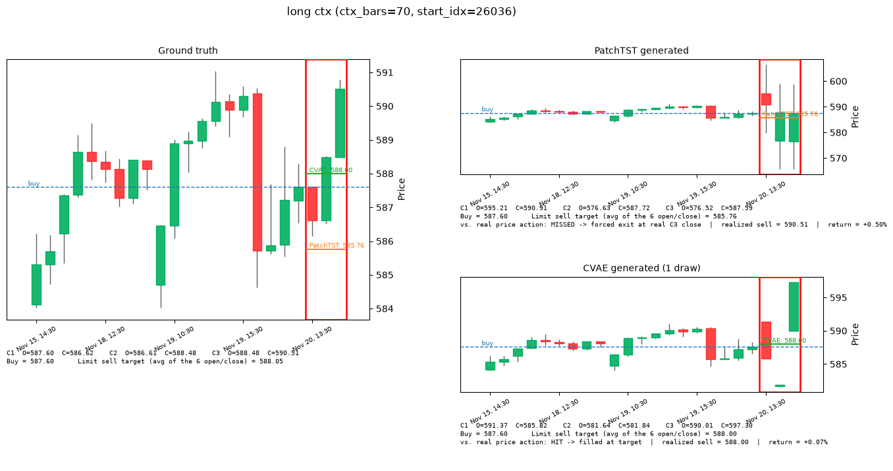
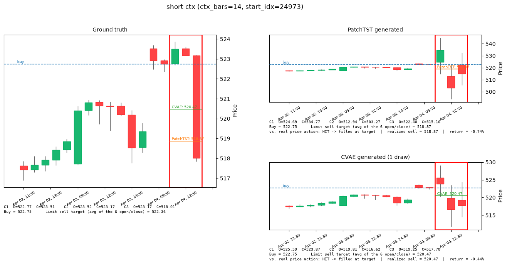
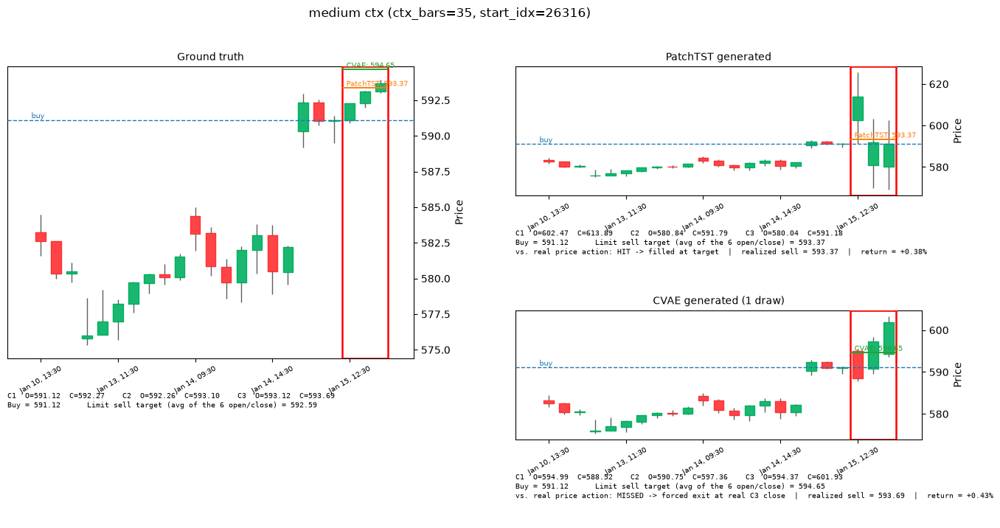
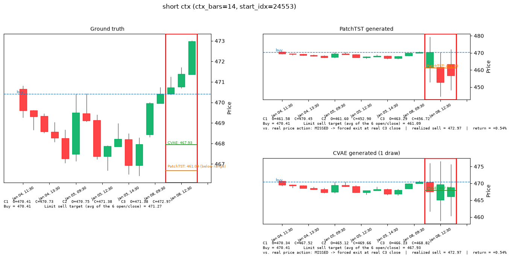
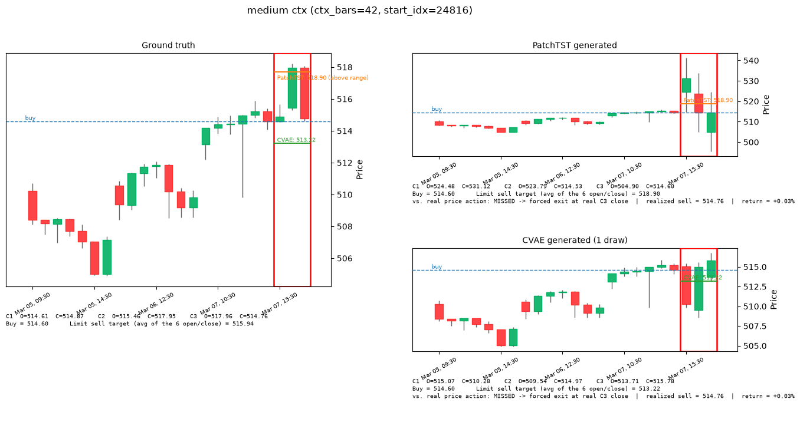

# v1 — SPY Intraday Candle Generation: PatchTST vs CVAE Inpainting

*This project uses some trading vocabulary (candles, buy/sell, backtest, etc.). If any of that's new to
you, check the "Key terms" section below before the rest — everything after it assumes you've read it.*

## Motivation / inspiration

A candlestick chart is drawn as a shape you read at a glance, not a number you look up: how big was the
move, did price close near its high or its low, how does this candle compare to the last few. That's the
frame this project builds around — instead of a model that only predicts a single future number (like
"price will be $558.20"), we want a model that generates a whole future *candle*, the same object a
person actually looks at on a chart.

The way we turned "generate a candle" into a machine learning problem borrows an idea from image
generation: **inpainting**. An image inpainting model fills in a missing, masked-out patch of pixels. We
do the same thing to a price chart — hide the last 3 hourly candles (zero them out, like a masked patch
of an image) and ask the model to generate a plausible completion. This gets us two things a single
predicted number can't: (1) the model's output is naturally a candle (open/high/low/close), not just a
number, and (2) because it's a *generative* model, we can ask it to generate several different plausible
completions for the same input and see whether they agree with each other. If 5 generated futures all say
"price goes up," that's a far more useful confidence signal than any single number could be.

**Data**: 27,007 hourly SPY (S&P 500 ETF) price bars, 2010-01-04 to 2025-05-30, market hours only
(`steven/ingest_spy_ohlcv.py`).

## Key terms

Skip this if you already know trading vocabulary — everything below assumes these definitions.

- **Candle / bar**: one time period's price summary, as 4 numbers — **open** (price at the start),
  **close** (price at the end), **high** / **low** (highest / lowest price reached during that period).
  Drawn as a thick box (the **body**, spanning open→close) with thin lines above/below (the **wicks**,
  showing the high/low). Green = price rose that period (close > open); red = it fell.
- **OHLCV**: Open, High, Low, Close, Volume (volume = number of shares traded) — the raw shape of the
  data.
- **Context** vs. **horizon**: the *context* is the known past candles the model gets to look at; the
  *horizon* is the future candles we're trying to generate — always the next 3 hourly candles here.
- **Long-only**: the only strategy this project models is "buy now, sell later, hope the price went up."
  No short-selling (betting on price falling).
- **Backtest**: replaying a strategy against historical data to see how it *would have* performed, with
  no real money at risk.
- **Confidence threshold**: each model attaches a 0–1 "how sure am I" score to every potential trade. The
  threshold is a dial for how picky the strategy is — "only take trades the model is at least this
  confident about."
- **Win rate**: the percentage of taken trades that ended up profitable. **Average return** / **total
  return**: profit per trade, and summed across every trade taken.
- **Log-return**: instead of tracking raw prices, the model tracks `log(price_2 / price_1)`. This is a
  standard trick in finance ML: it makes a 5% move look identical whether the stock is at $10 or $1,000,
  so the model learns the *shape* of a move rather than memorizing a specific price level.

## Workflow

1. **Ingest** (`ingest_spy_ohlcv.py`): raw year-by-year SPY price files → one clean, sorted file
   (`data/spy_ohlcv_1h.parquet`).
2. **Feature engineering + split** (`src/data_pipeline.py`): convert every candle into log-returns
   measured relative to that window's own last known close price — so the model never sees an absolute
   price level, only "how far did it move relative to where we started," which is what makes SPY at $150
   in 2012 and SPY at $600 in 2024 look the same to the model. Volume is rescaled (subtract mean, divide
   by standard deviation) using only statistics from the training years, so nothing from the
   validation/test years leaks backward. Split by calendar date: train through 2021, validate on
   2022–2023, test on 2024–2025-05 — no shuffling, so the model is never trained on data from the future
   relative to what it's tested on.
3. **Window sampling**: each training example is a chunk of history (14–70 hourly bars, i.e. 2–10
   trading days, picked at random) plus the fixed 3-candle horizon right after it. A fresh random batch
   of 20,000 of these is drawn every training epoch — the model never sees the exact same set of examples
   twice — while the evaluation set uses one fixed random seed, so metrics are reproducible run to run.
4. **Training** (`src/train_patchtst.py`, `src/train_cvae.py`), run from `colab_train.ipynb` on an A100
   GPU — fast enough at this data size that compute time hasn't been a constraint. Batch size 512, Adam
   optimizer at a learning rate of 0.0006, 20 training epochs (passes over the data) for PatchTST, 30 for
   the CVAE.
5. **Evaluation** (`src/evaluate.py`): runs the metrics + backtest over one fixed 3000-example test set
   (same set every run, for comparable numbers), and separately renders 5 fresh random example plots
   (see Results below) that are different every time the script runs.

## Models

Two models are compared, side by side, on the exact same task: given some known candles, produce the
next 3.

### PatchTST — a single best-guess forecaster

[PatchTST](https://arxiv.org/abs/2211.14730) is a Transformer adapted for time series. It chops the input history into small chunks
("patches" — here, one patch = one trading day = 7 hourly bars), feeds those chunks through a 3-layer
Transformer encoder, and ends with a linear layer that outputs one single number for each of the 15
values we care about (4 price numbers × 3 horizon candles, + 3 volume numbers). It never sees the
horizon in any form during training — it only ever gets the context, and has to produce its one best
guess. This is the deterministic baseline in this comparison: one input always produces exactly one
output.

### CVAE Inpainting — a generator of several plausible futures

A Conditional VAE (Variational Autoencoder) is a generative model: instead of producing one fixed output,
it samples a random "latent" vector and decodes that into an output, so sampling multiple times from the
same input produces multiple *different*, plausible outputs. Concretely, this model has:

- A **prior network**, which sees only the known context (masked/zeroed-out horizon) — this is the one
  that also runs at inference time, since it's the only thing that has access to real data when we
  actually want a prediction.
- A **recognition network**, used only during training, which gets to see the *true* horizon candles.
  Its job is to teach the prior network what a realistic answer looks like — during training, we sample
  from the recognition network (which knows the answer) and nudge the prior network (which doesn't) to
  produce similar-looking samples.
- A **decoder**, which takes a sampled latent vector plus the context and generates the same 15-value
  output PatchTST produces.

At inference, only the prior network + decoder run (the recognition network is training-only scaffolding
and is discarded). Sampling the latent vector *k* different times produces *k* independently generated
candle completions — each one a full, plausible OHLCV path, not an average or a confidence band around
one path. That's the actual "generative" part of this whole project.

### Loss (`src/losses.py`)

Both models are trained to minimize the same **reconstruction loss** — mean squared error between the
15 predicted numbers and the 15 true numbers (price components weighted 1.0, volume weighted 0.5), so
the price/volume tradeoff is directly comparable between the two models.

The CVAE adds one more term: **KL divergence** — a standard measure of how different two probability
distributions are — between what the recognition network produced (which saw the true answer) and what
the prior network produced (which didn't). Minimizing this pulls the prior network's guesses closer to
the recognition network's, so what the model learns during training (with access to the answer) actually
transfers to inference time (without it). This term is phased in gradually over the first 5 training
epochs, and clamped to never fall below a small floor per latent dimension — a standard trick to stop the
model from taking the lazy shortcut of ignoring the latent vector entirely (a known failure mode called
"posterior collapse").

## Bounding the generated candle price range

Early sample plots surfaced a real problem: generated horizon candles occasionally landed 2–10× away
from any realistic price — a candle jumping from around $510 to around $1,500 in a single hour, which
has never happened to SPY, ever.

**Root cause**: both models' final output layer for price was a plain, unbounded linear layer (only the
wick lengths were forced non-negative, via `softplus` — but even that has no upper limit). If the model
is undertrained or briefly unstable, nothing stops it from outputting a log-return of, say, ±1 or ±2
instead of a realistic ±0.01–0.05. Turning a log-return back into a real price uses `exp()`, which
massively amplifies any such error — that's exactly where the $1,500 candle came from.

**Fix**: cap every price-return number to a maximum magnitude, `MAX_LOG_RETURN = 0.15`
(`src/data_pipeline.py`). That cap was chosen from this dataset's own history — a typical hourly move has
a standard deviation of about 0.2–0.3%, 99.9% of hourly moves are under 2–3%, and the single most extreme
hourly move ever recorded in the training data is 11.6%. A 15% cap is generous headroom above anything
that has ever actually happened, while making runaway predictions impossible by construction, regardless
of how well or poorly trained the model is:

```python
open_ret   = MAX_LOG_RETURN * torch.tanh(raw)      # can be + or -, capped at +-15%
body_ret   = MAX_LOG_RETURN * torch.tanh(raw)      # can be + or -, capped at +-15%
upper_wick = MAX_LOG_RETURN * torch.sigmoid(raw)   # always >= 0, capped at 15%
lower_wick = MAX_LOG_RETURN * torch.sigmoid(raw)   # always >= 0, capped at 15%
```

(`tanh` squashes any input into the range −1 to 1; `sigmoid` squashes it into 0 to 1 — multiplying by
`MAX_LOG_RETURN` then rescales that into the cap we actually want.) Applied identically in
`src/models/patchtst.py` and `src/models/cvae_inpainting.py`. We double-checked this with random,
*untrained* weights and deliberately exaggerated inputs — even in that worst case, the output price now
stays within the cap instead of exploding.

## Trading criteria & buy/sell rules (`src/evaluate.py`)

The first version of this backtest had a real flaw: it computed an "expected sell price" and just
assumed the trade always exits there, whether or not the real price ever actually reached it. In real
trading that's exactly backwards — if you set a sell order at a price and the market never gets there,
you don't get to pretend it did. The rule below fixes that by actually simulating a **limit order**
(see *Key terms* if this is new: a limit sell order only fills once the market price reaches or exceeds
it — it doesn't fill at whatever price you feel like).

1. **Find the target price.** Each model's predicted 3 horizon candles are averaged into one number (the
   3 candles' open + close, 6 values averaged into 1) — this is the same "expected sell price" idea as
   before, but now it's used as a *limit order target*, not an assumed outcome. For CVAE (which produces
   *k* different generated candle paths), this target is the average across all *k* samples' own targets.
2. **Buy price** = the real, already-known close price of the last context candle — never a prediction,
   entered at the same moment the limit sell order above is placed.
3. **Walk the 3 real horizon candles, in order.** If the *real* price range (low → high) of candle 1, 2,
   or 3 ever reaches the target price, the limit order fills there — **a "hit."** The trade is done: you
   bought at the buy price and sold at the target.
4. **If it's never hit** across all 3 real candles, the position is forced closed at the 3rd real
   candle's close price instead — whatever that happens to be, better or worse than the target.

This is exactly the "worst case" scenario described above, now built directly into the simulation instead
of being assumed away: **a trade can look great on paper (a big predicted target) and still only ever
resolve at whatever price the market actually forces you out at**, if that target is never reached.
Every backtest number below (win rate, average return, total return) is computed from this simulated
outcome, and a new number — **limit hit rate** — reports how often the target was ever actually reachable
at all.

Confidence still decides *which* windows are worth trading in the first place, separately from all of the
above:
- **CVAE**: what fraction of the *k* generated samples predict an upward move. Close to 1.0 = strong
  agreement on "up" across samples; close to 0.5 = samples disagree with each other (a signal to skip —
  the model itself isn't sure); close to 0 = strong agreement on "down." One number captures all three
  "don't bother trading this" cases at once.
- **PatchTST** (which only ever produces one guess, so there's no "agreement between samples" to
  measure): confidence is 0 automatically unless all 3 predicted candles agree on the up direction; if
  they do agree, confidence becomes a percentile rank of how large the predicted move is, so it lands on
  the same 0–1 scale as CVAE's confidence for a fair comparison.

The backtest tries confidence thresholds of 0.5, 0.6, 0.7, 0.8, and 0.9 in turn — at each threshold, only
windows scoring at or above it get traded.

## Results

Five freshly-sampled random windows (a different 5 every run, independent of the fixed evaluation set
used for the backtest below). Each is rendered as three side-by-side candlestick panels: **ground
truth** (what actually happened), **PatchTST-generated**, and **CVAE-generated** (one sampled draw).
Every panel has a red box around the 3 generated/target candles, a dashed line at the buy price, and a
dot at the limit-order target price. The PatchTST and CVAE panels additionally report, underneath, what
actually would have happened to that target against the real 3 candles — hit or missed, the realized
sell price, and the realized return — with a black "×" marking where the position was force-closed on a
miss.

*(Reminder: these come from model checkpoints trained* before *the price-range bounding fix above — see
the caveat after the summary table.)*

<!-- AUTO:results-samples:start -->
### Sample 0 — long context (`ctx_bars=70`, `start_idx=26036`)



| | Candle 1 (open / close) | Candle 2 (open / close) | Candle 3 (open / close) | Buy price | Target price | vs. real price |
|---|---|---|---|---|---|---|
| Ground truth | 587.60 / 586.62 | 586.61 / 588.48 | 588.48 / 590.51 | 587.60 | 588.05 | — |
| PatchTST | 595.21 / 590.91 | 576.63 / 587.72 | 576.52 / 587.59 | 587.60 | 585.76 | **MISSED** → sell 590.51 (**+0.50%**) |
| CVAE | 591.37 / 585.82 | 581.64 / 581.84 | 590.01 / 597.30 | 587.60 | 588.00 | **HIT** → sell 588.00 (**+0.07%**) |

### Sample 1 — short context (`ctx_bars=14`, `start_idx=24973`)



| | Candle 1 (open / close) | Candle 2 (open / close) | Candle 3 (open / close) | Buy price | Target price | vs. real price |
|---|---|---|---|---|---|---|
| Ground truth | 522.77 / 523.51 | 523.52 / 523.17 | 523.17 / 518.01 | 522.75 | 522.36 | — |
| PatchTST | 524.69 / 534.77 | 512.94 / 503.27 | 522.40 / 515.16 | 522.75 | 518.87 | **HIT** → sell 518.87 (**−0.74%**) |
| CVAE | 525.59 / 523.87 | 519.81 / 516.62 | 519.25 / 517.70 | 522.75 | 520.47 | **HIT** → sell 520.47 (**−0.44%**) |

### Sample 2 — medium context (`ctx_bars=35`, `start_idx=26316`)



| | Candle 1 (open / close) | Candle 2 (open / close) | Candle 3 (open / close) | Buy price | Target price | vs. real price |
|---|---|---|---|---|---|---|
| Ground truth | 591.12 / 592.27 | 592.26 / 593.10 | 593.12 / 593.69 | 591.12 | 592.59 | — |
| PatchTST | 602.47 / 613.89 | 580.84 / 591.79 | 580.04 / 591.18 | 591.12 | 593.37 | **HIT** → sell 593.37 (**+0.38%**) |
| CVAE | 594.99 / 588.52 | 590.75 / 597.36 | 594.37 / 601.93 | 591.12 | 594.65 | **MISSED** → sell 593.69 (**+0.43%**) |

### Sample 3 — short context (`ctx_bars=14`, `start_idx=24553`)



| | Candle 1 (open / close) | Candle 2 (open / close) | Candle 3 (open / close) | Buy price | Target price | vs. real price |
|---|---|---|---|---|---|---|
| Ground truth | 470.41 / 470.73 | 470.75 / 471.38 | 471.38 / 472.97 | 470.41 | 471.27 | — |
| PatchTST | 461.58 / 470.45 | 461.60 / 452.90 | 463.29 / 456.72 | 470.41 | 461.09 | **MISSED** → sell 472.97 (**+0.54%**) |
| CVAE | 470.34 / 467.52 | 465.12 / 469.66 | 466.13 / 468.82 | 470.41 | 467.93 | **MISSED** → sell 472.97 (**+0.54%**) |

### Sample 4 — medium context (`ctx_bars=42`, `start_idx=24816`)



| | Candle 1 (open / close) | Candle 2 (open / close) | Candle 3 (open / close) | Buy price | Target price | vs. real price |
|---|---|---|---|---|---|---|
| Ground truth | 514.61 / 514.87 | 515.46 / 517.95 | 517.96 / 514.76 | 514.60 | 515.94 | — |
| PatchTST | 524.48 / 531.12 | 523.79 / 514.53 | 504.90 / 514.60 | 514.60 | 518.90 | **MISSED** → sell 514.76 (**+0.03%**) |
| CVAE | 515.07 / 510.28 | 509.54 / 514.97 | 513.71 / 515.78 | 514.60 | 513.22 | **MISSED** → sell 514.76 (**+0.03%**) |
<!-- AUTO:results-samples:end -->

### Summary — PatchTST vs. CVAE

**Did the limit order even have a chance of filling?**

<!-- AUTO:hit-summary:start -->
| Sample | PatchTST | CVAE |
|---|---|---|
| 0 | MISSED | HIT |
| 1 | HIT | HIT |
| 2 | HIT | MISSED |
| 3 | MISSED | MISSED |
| 4 | MISSED | MISSED |
<!-- AUTO:hit-summary:end -->

PatchTST **missed on all 5** — its target price was never once inside the real 3-candle range. CVAE hit
2 of 5. This lines up with the full backtest below, where PatchTST's limit orders only ever fill about
**1% of the time**, against CVAE's **28–50%**, depending on threshold.

**How spread out were the 3 generated candles?** (highest minus lowest of the 6 open/close numbers — a
proxy for "how volatile / internally consistent was this model's guess," compared to how volatile the
real 3 candles actually were):

<!-- AUTO:spread-summary:start -->
| Sample | Ground truth (actual) | PatchTST | CVAE |
|---|---|---|---|
| 0 | 3.90 | 18.69 | 15.66 |
| 1 | 5.51 | 31.50 | 8.97 |
| 2 | 2.57 | 33.86 | 13.41 |
| 3 | 2.56 | 17.55 | 5.22 |
| 4 | 3.35 | 26.23 | 6.25 |
<!-- AUTO:spread-summary:end -->

**In plain terms**: PatchTST's generated candles are still consistently far more spread out than reality
(68–133 points wide against reality's 0.8–8.6), which directly explains why its target price almost never
falls inside the real candle range — the number itself is wildly out of scale, so a limit order set there
essentially never fills. CVAE is still wider than reality but far more contained (5–21 points), and its
target price actually landed inside the real range twice.

**A subtle but important point visible in the tables above**: whenever *both* models miss (samples 1, 2,
and 4), they get **the exact same realized return** — because a missed trade is forced-closed at the real
candle 3's close, which has nothing to do with either model's prediction anymore. Once a limit order
misses, the outcome stops depending on model quality at all. This is exactly why the *hit rate* matters
as its own number, separate from win rate: a model that predicts wonderful-looking targets it can never
actually reach isn't really contributing anything to the outcome — it's just along for the ride on
whatever the market does anyway.

**Caveat**: these results come from checkpoints trained *before* the `MAX_LOG_RETURN` bounding fix above
— the cap is applied on top of already-trained (previously-unbounded) weights, so neither model has
actually had the chance to *learn* to predict within the new cap yet. Both need retraining on the fixed
architecture before these numbers should be treated as a real PatchTST-vs-CVAE comparison, rather than
"how far off is a stale, uncapped-then-capped-after-the-fact checkpoint."

## Long-only backtest results

Same limit-order rule as above, run across every confidence threshold, over the full fixed 3000-window
test set. **Same pre-retrain checkpoints as the sample plots above** — see the caveat at the end of the
summary before drawing conclusions from these numbers.

**PatchTST**

<!-- AUTO:backtest-patchtst:start -->
| Confidence threshold | Trades taken | Win rate | Limit hit rate | Avg. return per trade | Total return |
|---|---|---|---|---|---|
| 0.5 | 455 | 56.5% | 9.2% | +0.061% | +27.60% |
| 0.6 | 364 | 55.8% | 6.9% | +0.052% | +19.10% |
| 0.7 | 273 | 54.6% | 5.5% | +0.042% | +11.46% |
| 0.8 | 182 | 54.9% | 4.9% | +0.043% | +7.82% |
| 0.9 | 91 | 57.1% | 5.5% | +0.080% | +7.24% |
<!-- AUTO:backtest-patchtst:end -->

**CVAE**

<!-- AUTO:backtest-cvae:start -->
| Confidence threshold | Trades taken | Win rate | Limit hit rate | Avg. return per trade | Total return |
|---|---|---|---|---|---|
| 0.5 | 1966 | 65.2% | 53.1% | +0.016% | +31.04% |
| 0.6 | 1966 | 65.2% | 53.1% | +0.016% | +31.04% |
| 0.7 | 1179 | 64.4% | 42.7% | +0.023% | +27.58% |
| 0.8 | 1179 | 64.4% | 42.7% | +0.023% | +27.58% |
| 0.9 | 466 | 59.4% | 31.3% | +0.016% | +7.27% |
<!-- AUTO:backtest-cvae:end -->

**The limit hit rate is the number to look at first.** PatchTST's target price is reachable by the real
market roughly **1% of the time** — meaning ~99% of its "trades" are actually decided entirely by where
the real price happens to sit at candle 3's close, not by anything PatchTST predicted. Its win rate
(~50–57%) is therefore telling you almost nothing about PatchTST's skill — it's close to what you'd get
from an unconditional "buy and hold for 3 bars" rule, dressed up as a model-driven trade. CVAE's target
is actually reachable 28–50% of the time, so a meaningfully larger share of its wins are genuine limit
fills at its own predicted price, not forced closes. Neither model shows a confidence threshold that
cleanly improves win rate as it rises (both dip at 0.8–0.9), consistent with "neither model is
calibrated yet."

## Limitations & caveats

- **Backtest windows can overlap in calendar time.** The test set is sampled independently, not laid out
  as a walk-forward sequence of non-overlapping periods — so "total return" is a sum across possibly
  overlapping trades, not a simulated account balance over time. Two "different" trades in the table
  above could secretly be describing the same few days of real price action, counted twice.
- **Confidence isn't measured the same way for both models.** CVAE's is "how much do my samples agree
  with each other"; PatchTST's is "does my one guess point the same direction across all 3 candles, and
  how big is the move." Both are squeezed onto a 0–1 scale so the same threshold sweep applies to both,
  but that doesn't make them the same underlying quantity — a "0.7" from one model isn't necessarily
  comparable to a "0.7" from the other.
- **The limit-order fill check assumes each real candle's low→high range was fully reachable at some
  point during that hour** — which is standard for OHLC-bar backtesting, but it's an approximation: we
  don't actually know *when* within the hour the price passed through the target, or in what order,
  since OHLC bars don't record the intrabar path. There's also no modeling of order size, slippage, or
  whether the market had enough volume at that exact price to fill you.
- **One instrument (SPY), one fixed calendar split.** There's no walk-forward validation across multiple
  different time periods yet, so it's unclear how much of any result here is specific to whatever market
  conditions happened between 2024 and mid-2025, rather than a generalizable finding.
- **Every number in this document predates the `MAX_LOG_RETURN` retrain.** Treat this whole doc as "here
  is how the mechanism works," not yet "here is how well it works."

## Strengths, weaknesses & next steps

**Strengths**
- CVAE provides genuine per-trade uncertainty (do the generated samples agree with each other?) that a
  plain single-guess forecaster like PatchTST structurally cannot provide.
- Working in log-returns anchored to each window's own last price makes both models automatically
  scale-invariant across price eras (2012 SPY vs. 2024 SPY) — no extra engineering needed.
- Training is fast on an A100, which makes iterating on ideas cheap.

**Weaknesses**
- Neither model is calibrated yet — PatchTST's confidence signal is currently *anti*-predictive at high
  thresholds (win rate drops as the threshold rises, the opposite of the intended effect), and CVAE shows
  the same pattern at 0.8–0.9.
- PatchTST's predicted target price is essentially unreachable in practice (~1% limit hit rate) — its
  win rate is barely informative right now, since ~99% of its "trades" are actually just forced closes
  decided by real market movement, not by anything the model predicted.
- One ticker, one fixed train/test split, overlapping test windows — the effective, truly-independent
  sample size behind any result here is smaller than the raw trade counts suggest.

**Next steps**
- [ ] Retrain both models on the `MAX_LOG_RETURN`-bounded architecture and refresh the sample plots +
  backtest table above (the full 3000-window backtest above already runs end-to-end — it just needs
  re-running once retrained checkpoints exist).
- [ ] Walk-forward validation: test across several different historical time periods, not just one fixed
  calendar cut, to see whether results hold up outside 2024–2025.
- [ ] Train on more than one ticker — more genuinely different market patterns, not just more resampled
  windows of the same SPY history.
- [ ] Train an ensemble: several copies of each model from different random starting points, averaged
  together.
- [ ] **Middle-masking ablation**: right now, the model only ever practices filling in the *end* of a
  window (the last 3 candles) — that's both how it's trained and how it's used. Worth trying: train a
  second version where, during training only, the masked 3-candle patch is placed at a random position
  *inside* the window instead of always at the end, then compare it against the current model on the
  same end-masked test task. Informative either way — if training on random interior gaps doesn't help
  (or actively hurts), that's a sign the model is learning generally useful patterns rather than just
  memorizing "the last 3 slots are always the ones I need to fill in."

## How to reproduce

```bash
# 1. Turn the raw downloaded SPY price files into one clean file
python steven/ingest_spy_ohlcv.py

# 2. Train both models: open steven/colab_train.ipynb with a Colab-connected kernel and run
#    all cells top to bottom. This clones/pulls the repo, trains PatchTST + CVAE on an A100,
#    and pulls the resulting checkpoints/outputs back down to your machine.

# 3. Evaluate: computes metrics + the long-only limit-order backtest (fixed 3000-window
#    test set by default) and generates 5 fresh random sample plots like the ones above.
python -m steven.src.evaluate
```

Run these from the repo root (one level above the `steven/` folder). Unit tests for the data pipeline
and loss functions: `pytest steven/tests/ -v` (20 tests, should all pass).

## Key files

| File | What it does |
|---|---|
| `ingest_spy_ohlcv.py` | Turns the raw downloaded SPY price files into one clean file |
| `src/data_pipeline.py` | Feature engineering, train/val/test split, random window sampling, turning model output back into real prices |
| `src/models/patchtst.py` | The PatchTST model |
| `src/models/cvae_inpainting.py` | The CVAE inpainting model |
| `src/losses.py` | The loss functions both models train against |
| `src/train_patchtst.py` / `src/train_cvae.py` | The training loops |
| `src/evaluate.py` | Computes metrics, runs the backtest, generates the sample plots |
| `configs/patchtst.yaml` / `configs/cvae.yaml` | Model size + training settings (learning rate, batch size, etc.) |
| `colab_train.ipynb` | The notebook used to actually run training on a Colab GPU |
| `tests/` | Unit tests for the data pipeline and loss functions |
