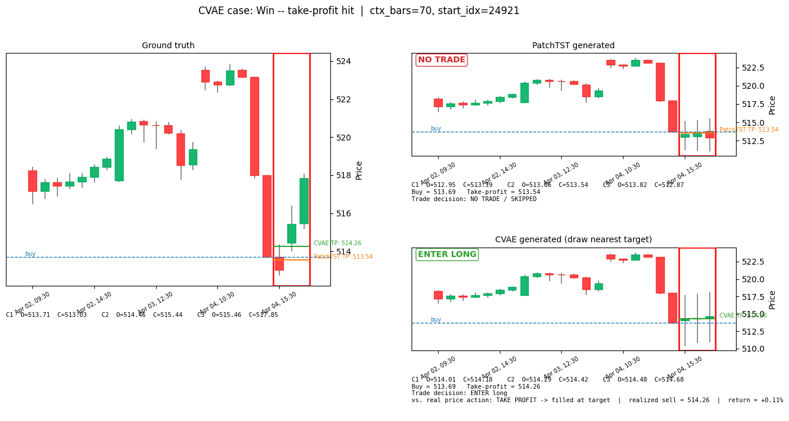
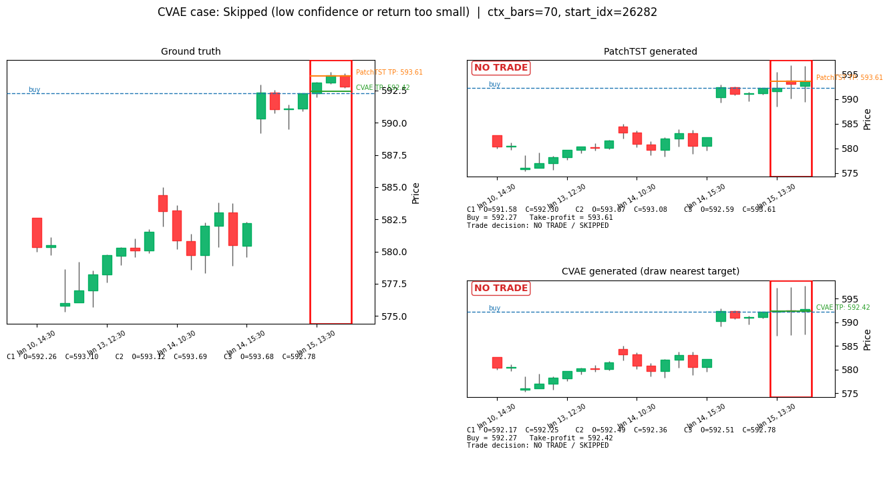
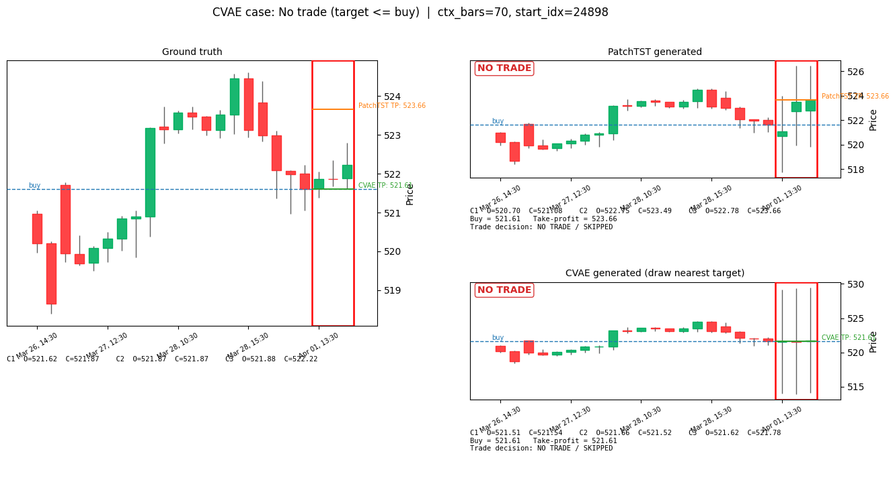

# v1 — SPY Intraday Candle Generation: PatchTST vs CVAE Inpainting

*This project uses some trading vocabulary (candles, buy/sell, backtest, etc.). If any of that's new to
you, check the "Key terms" section below before the rest — everything after it assumes you've read it.*

*The **Results** and **Walk-forward backtest** sections below are regenerated wholesale by
`update_report.py` from whatever the latest `evaluate.py` run produced (see `How to reproduce`) —
deliberately presented without interpretation, so this doc stays accurate no matter who last ran the
pipeline or what numbers came out. Read the actual tables for the current story; nothing here asserts
what they "should" say.*

## Motivation / inspiration

A candlestick chart is drawn as a shape you read at a glance, not a number you look up: how big was the
move, did price close near its high or its low, how does this candle compare to the last few. That's the
frame this project builds around — instead of a model that only predicts a single future number (like
"price will be $558.20"), we want a model that generates a whole future *candle*, the same object a
person actually looks at on a chart.

The way we turned "generate a candle" into a machine learning problem borrows an idea from image
generation: **inpainting**. An image inpainting model fills in a missing, masked-out patch of pixels. We
do the same thing to a price chart — hide the last 3 hourly candles (zero them out, like a masked patch
of an image) and ask the model to generate a plausible completion. This gets us two things a single
predicted number can't: (1) the model's output is naturally a candle (open/high/low/close), not just a
number, and (2) because it's a *generative* model, we can ask it to generate several different plausible
completions for the same input and see whether they agree with each other. If 5 generated futures all say
"price goes up," that's a far more useful confidence signal than any single number could be.

**Data**: 27,007 hourly SPY (S&P 500 ETF) price bars, 2010-01-04 to 2025-05-30, market hours only
(`steven/ingest_spy_ohlcv.py`).

## Key terms

Skip this if you already know trading vocabulary — everything below assumes these definitions.

- **Candle / bar**: one time period's price summary, as 4 numbers — **open** (price at the start),
  **close** (price at the end), **high** / **low** (highest / lowest price reached during that period).
  Drawn as a thick box (the **body**, spanning open→close) with thin lines above/below (the **wicks**,
  showing the high/low). Green = price rose that period (close > open); red = it fell.
- **OHLCV**: Open, High, Low, Close, Volume (volume = number of shares traded) — the raw shape of the
  data.
- **Context** vs. **horizon**: the *context* is the known past candles the model gets to look at; the
  *horizon* is the future candles we're trying to generate — always the next 3 hourly candles here.
- **Long-only**: the only strategy this project models is "buy now, sell later, hope the price went up."
  No short-selling (betting on price falling).
- **Backtest**: replaying a strategy against historical data to see how it *would have* performed, with
  no real money at risk. This project uses a **walk-forward backtest**: one continuous pass through the
  test period in real chronological order, one decision at a time, the way an actual account would
  experience it — as opposed to evaluating a large batch of independently-sampled windows (an earlier
  version of this project did that instead; dropped once the walk-forward backtest existed, since
  overlapping windows don't produce a real equity curve — see `backlog.md`/git history if curious).
- **Confidence threshold**: each model attaches a 0–1 "how sure am I" score to every potential trade. The
  threshold is a dial for how picky the strategy is — "only take trades the model is at least this
  confident about."
- **Minimum return threshold**: a second, independent dial — even when a model is confident *and* its
  target technically clears the buy price, the predicted edge might be tiny (e.g. +0.02%). This threshold
  requires the model's own predicted move to clear a minimum size before bothering to trade at all (see
  *Trading criteria* below).
- **Bracket order**: two orders placed at once when you buy — a **take-profit** limit sell above your
  entry price, and a **stop-loss** below it. Whichever one the market reaches first closes the position.
  Tried in this project and then removed (see *Trading criteria* below) — the current strategy only ever
  places a take-profit, no stop-loss.
- **Quantile / percentile**: the value below which a given fraction of a set of numbers falls — "the 70th
  percentile of these 5 numbers" means 70% of them are at or below that value. Used here to pick a
  take-profit target from a *distribution* of model-generated outcomes, rather than just averaging them.
- **Win rate**: the percentage of taken trades that ended up profitable. **Average return** / **total
  return**: profit per trade, and summed (or, for a walk-forward equity curve, compounded) across every
  trade taken.
- **Log-return**: instead of tracking raw prices, the model tracks `log(price_2 / price_1)`. This is a
  standard trick in finance ML: it makes a 5% move look identical whether the stock is at $10 or $1,000,
  so the model learns the *shape* of a move rather than memorizing a specific price level.

## Workflow

1. **Ingest** (`ingest_spy_ohlcv.py`): raw year-by-year SPY price files → one clean, sorted file
   (`data/spy_ohlcv_1h.parquet`).
2. **Feature engineering + split** (`src/data_pipeline.py`): convert every candle into log-returns
   measured relative to that window's own last known close price — so the model never sees an absolute
   price level, only "how far did it move relative to where we started," which is what makes SPY at $150
   in 2012 and SPY at $600 in 2024 look the same to the model. Volume is rescaled (subtract mean, divide
   by standard deviation) using only statistics from the training years, so nothing from the
   validation/test years leaks backward. Split by calendar date: train through 2021, validate on
   2022–2023, test on 2024–2025-05 — no shuffling, so the model is never trained on data from the future
   relative to what it's tested on.
3. **Window sampling (training only)**: each training example is a chunk of history (14–70 hourly bars,
   i.e. 2–10 trading days, picked at random) plus the fixed 3-candle horizon right after it. A fresh
   random batch of 20,000 of these is drawn every training epoch — the model never sees the exact same set
   of examples twice. Evaluation (see below) doesn't use this random-window scheme at all — it walks the
   test period in fixed, deterministic chronological order instead.
4. **Training** (`src/train_patchtst.py`, `src/train_cvae.py`), run from `colab_train.ipynb` on an A100
   GPU — fast enough at this data size that compute time hasn't been a constraint. Batch size 512, Adam
   optimizer at a learning rate of 0.0006, 20 training epochs (passes over the data) for PatchTST, 30 for
   the CVAE.
5. **Evaluation** (`src/evaluate.py`): walks the entire test period once, in real chronological order, one
   decision at a time (see *Walk-forward backtest* below) — always using the max 70-bar context, since a
   real deployment would always use as much history as it has available. Along the way it also picks one
   illustrative example per trade-outcome case (see *Results* below) straight from that same walk, and
   renders those as sample plots. Everything (metrics, backtest, sample plots) comes from this single
   pass over the checkpoints on disk — no random test-set sampling involved anywhere in evaluation.

## Models

Two models are compared, side by side, on the exact same task: given some known candles, produce the
next 3.

### PatchTST — a single best-guess forecaster

[PatchTST](https://arxiv.org/abs/2211.14730) is a Transformer adapted for time series. It chops the input history into small chunks
("patches" — here, one patch = one trading day = 7 hourly bars), feeds those chunks through a 3-layer
Transformer encoder, and ends with a linear layer that outputs one single number for each of the 15
values we care about (4 price numbers × 3 horizon candles, + 3 volume numbers). It never sees the
horizon in any form during training — it only ever gets the context, and has to produce its one best
guess. This is the deterministic baseline in this comparison: one input always produces exactly one
output.

### CVAE Inpainting — a generator of several plausible futures

A Conditional VAE (Variational Autoencoder) is a generative model: instead of producing one fixed output,
it samples a random "latent" vector and decodes that into an output, so sampling multiple times from the
same input produces multiple *different*, plausible outputs. Concretely, this model has:

- A **prior network**, which sees only the known context (masked/zeroed-out horizon) — this is the one
  that also runs at inference time, since it's the only thing that has access to real data when we
  actually want a prediction.
- A **recognition network**, used only during training, which gets to see the *true* horizon candles.
  Its job is to teach the prior network what a realistic answer looks like — during training, we sample
  from the recognition network (which knows the answer) and nudge the prior network (which doesn't) to
  produce similar-looking samples.
- A **decoder**, which takes a sampled latent vector plus the context and generates the same 15-value
  output PatchTST produces.

At inference, only the prior network + decoder run (the recognition network is training-only scaffolding
and is discarded). Sampling the latent vector *k* different times produces *k* independently generated
candle completions — each one a full, plausible OHLCV path, not an average or a confidence band around
one path. That's the actual "generative" part of this whole project.

### Loss (`src/losses.py`)

Both models are trained to minimize the same **reconstruction loss** — mean squared error between the
15 predicted numbers and the 15 true numbers (price components weighted 1.0, volume weighted 0.5), so
the price/volume tradeoff is directly comparable between the two models.

The CVAE adds one more term: **KL divergence** — a standard measure of how different two probability
distributions are — between what the recognition network produced (which saw the true answer) and what
the prior network produced (which didn't). Minimizing this pulls the prior network's guesses closer to
the recognition network's, so what the model learns during training (with access to the answer) actually
transfers to inference time (without it). This term is phased in gradually over the first 5 training
epochs, and clamped to never fall below a small floor per latent dimension — a standard trick to stop the
model from taking the lazy shortcut of ignoring the latent vector entirely (a known failure mode called
"posterior collapse").

### A training diagnostic: KL divergence pinned at exactly 0.8000

Watching CVAE train (`src/train_cvae.py`'s epoch log), the reported KL loss settles to *exactly* `0.8000`
and then never moves again for the rest of training — not just on one run, this shows up the same way
across different training runs. That number isn't a coincidence: it's `z_dim × free_bits = 16 × 0.05 =
0.8` (`configs/cvae.yaml`). The loss code (`src/losses.py`) clamps each of the 16 latent dimensions' KL
to a floor of `free_bits=0.05` before summing them:

```python
kl = torch.clamp(kl, min=free_bits)  # free-bits floor: guards against posterior collapse
kl_loss = kl.sum(dim=-1).mean()
```

If the reported total is exactly `16 × 0.05` every epoch, every single one of those 16 dimensions is
sitting *at* the floor, all the time — meaning the true, unclamped KL between the recognition network's
posterior and the prior is at or below 0.05 nats everywhere, for the whole run. The free-bits floor is
supposed to be a rare emergency guard against KL collapsing all the way to zero, not something
permanently engaged from early in training. Consistently hitting the exact floor, run after run, is the
signature of **posterior collapse**: the recognition network (which sees the true horizon) isn't encoding
meaningfully more information than the prior (context-only) already has. Practically, this means the
CVAE's *k* sampled draws are likely getting most of their spread from the prior's own learned
context-conditioned uncertainty, not from `z` carrying genuinely different, data-driven hypotheses about
this specific window's true outcome — worth keeping in mind when reading anything that treats "CVAE's
samples disagree" as evidence the model learned something case-specific, rather than just replaying its
general uncertainty at this context length. This lines up with what the walk-forward backtest separately
surfaced: CVAE ends up trading on essentially every decision it makes (~99.6% on the checkpoint the
Results/backtest sections above were generated from) — its own confidence score rarely disagrees with
itself across the *k* samples, exactly what collapsed, low-diversity draws would produce.

**Likely root cause and fix attempted** (not yet retrained/validated — see `backlog.md` for the full
writeup): `decode()` concatenates `z` with the *full* context representation, and reconstruction loss is
plain MSE. Since SPY 1h log-returns are close to unpredictable noise beyond context, encoding real
target-specific information into `z` buys very little extra MSE reduction relative to its KL cost — the
optimizer can rationally let `z` collapse and get sample "diversity" for free by decoding noise around a
context-only prediction, never actually using `z` for genuinely different hypotheses. Three changes made
together to counter this: (1) `z_dim` 16→8 with `free_bits` 0.05→0.15 (same idea, concentrated: same or
higher total KL floor spread over half as many dimensions, forcing more real signal per dimension instead
of a thin trickle across 16); (2) cyclical KL annealing (3 ramp-then-hold cycles across training instead
of one ramp that stays maxed out for 25 of 30 epochs — see `kl_beta_schedule` in `train_cvae.py`), so the
decoder gets repeated chances to learn `z` is worth using instead of one; (3) `ctx_dropout=0.3` on the
context representation inside `decode()` only (never before the prior's own head), weakening the
decoder's always-available context-only bypass during training — the direct analogue of the classic "word
dropout" fix from the original VAE-collapse literature. Whether this actually worked is checkable after
the next retrain: if the reported KL still pins exactly at the new floor (`8 × 0.15 = 1.2`), these changes
weren't enough and the next lever is architectural (e.g. decouple the decoder's context input from the
prior's, or reduce decoder capacity directly).

## Bounding the generated candle price range

Early sample plots surfaced a real problem: generated horizon candles occasionally landed 2–10× away
from any realistic price — a candle jumping from around $510 to around $1,500 in a single hour, which
has never happened to SPY, ever.

**Root cause**: both models' final output layer for price was a plain, unbounded linear layer (only the
wick lengths were forced non-negative, via `softplus` — but even that has no upper limit). If the model
is undertrained or briefly unstable, nothing stops it from outputting a log-return of, say, ±1 or ±2
instead of a realistic ±0.01–0.05. Turning a log-return back into a real price uses `exp()`, which
massively amplifies any such error — that's exactly where the $1,500 candle came from.

**Fix**: cap every price-return number to a maximum magnitude, `MAX_LOG_RETURN = 0.15`
(`src/data_pipeline.py`). That cap was chosen from this dataset's own history — a typical hourly move has
a standard deviation of about 0.2–0.3%, 99.9% of hourly moves are under 2–3%, and the single most extreme
hourly move ever recorded in the training data is 11.6%. A 15% cap is generous headroom above anything
that has ever actually happened, while making runaway predictions impossible by construction, regardless
of how well or poorly trained the model is:

```python
open_ret   = MAX_LOG_RETURN * torch.tanh(raw)      # can be + or -, capped at +-15%
body_ret   = MAX_LOG_RETURN * torch.tanh(raw)      # can be + or -, capped at +-15%
upper_wick = MAX_LOG_RETURN * torch.sigmoid(raw)   # always >= 0, capped at 15%
lower_wick = MAX_LOG_RETURN * torch.sigmoid(raw)   # always >= 0, capped at 15%
```

(`tanh` squashes any input into the range −1 to 1; `sigmoid` squashes it into 0 to 1 — multiplying by
`MAX_LOG_RETURN` then rescales that into the cap we actually want.) Applied identically in
`src/models/patchtst.py` and `src/models/cvae_inpainting.py`. We double-checked this with random,
*untrained* weights and deliberately exaggerated inputs — even in that worst case, the output price now
stays within the cap instead of exploding.

## Trading criteria & buy/sell rules (`src/evaluate.py`)

The first version of this backtest had a real flaw: it computed an "expected sell price" and just
assumed the trade always exits there, whether or not the real price ever actually reached it. In real
trading that's exactly backwards — if you set a sell order at a price and the market never gets there,
you don't get to pretend it did. That's fixed by actually simulating a **take-profit limit order**
placed at the same moment as the buy, and walking the real 3 candles to see whether it would actually
have filled — rather than assuming a single predicted price is simply where the trade ends.

*(A second version briefly added a mirrored 1:1 **stop-loss** below entry too — a "bracket order," see
*Key terms*. It's deliberately not part of the strategy below; the rationale for why is at the end of
this section, after the mechanic itself.)*

1. **Find the take-profit price.** This is computed differently for the two models, because they aren't
   symmetric:
   - **PatchTST** produces one deterministic best guess, so its take-profit is the **max of its 3
     predicted horizon candles' own close prices** — the single most optimistic point on its own
     predicted path. It's a simple benchmark for comparison against CVAE, not meant to be a realistic
     trading rule on its own — see the caveat below on just how aggressive this makes it.
   - **CVAE** produces *k* independently sampled plausible futures for the same window, so instead of
     picking one candle's peak, we take the **70th percentile** of the *k* samples' own predicted exit
     prices. Concretely: for one window, take the *k* sampled exit-price estimates, sort them, and read
     off the value 70% of the way up. That means 70% of the model's own generated futures for this window
     implied an exit price at or below the target, and only 30% implied higher — the target deliberately
     aims at the more optimistic tail of the model's own uncertainty about this specific window, rather
     than its average guess. A higher percentile means a more aggressive target (bigger potential payout,
     lower chance of actually getting touched before the order expires); a lower one means the opposite.
     70 is a reasonable starting point, not something tuned by sweeping it against the backtest yet — see
     caveat below.

     *(Why not do this for PatchTST too? It only ever produces one guess — there's no distribution of
     outcomes to take a percentile of.)*
2. **Only enter if the take-profit clears the buy price by enough to bother.** Two separate gates:
   - `take_profit > buy_price` — a hard requirement; a window that fails this is never traded at any
     confidence level, and is labeled **no trade** (see *Results* below).
   - The predicted edge (`take_profit / buy_price - 1`) must also clear a **minimum return threshold**
     (`--min-return-threshold`, default 0.1%) — a technically-positive but trivially small predicted move
     isn't worth trading either. A window that clears the first gate but not this one is labeled
     **skipped**, alongside any window whose confidence (below) doesn't clear the threshold. 0.1% is a
     first-pass heuristic, not tuned/swept yet.
3. **Confidence must also clear its own threshold** (`--confidence-threshold`, fixed at 0.5) — see below
   for how each model's confidence score is computed. A window can fail this gate even after clearing
   both of the above.
4. **Buy price** = the real, already-known close price of the last context candle — never a prediction,
   entered at the same moment the take-profit order above is placed.
5. **Walk the 3 real horizon candles, in order.** If the *real* price range (low → high) of candle 1, 2,
   or 3 reaches the take-profit, the order fills there.
6. **If it's never reached** across all 3 real candles, the position is forced closed at the 3rd real
   candle's close price instead — whatever that happens to be, better or worse than the target. This is
   the **expiry** case.

This is exactly the "worst case" scenario described above, now built directly into the simulation instead
of being assumed away: **a trade can look great on paper (a big predicted take-profit) and still only
ever resolve at whatever price the market actually forces you out at**, if the target is never reached.
Every backtest number below (win rate, average return, total return) is computed from this simulated
outcome, and a **take-profit rate** number reports how often the target actually got touched at all.

Confidence decides *which* windows are worth trading in the first place, on top of the return-threshold
gate above:
- **CVAE**: what fraction of the *k* generated samples predict an upward move. Close to 1.0 = strong
  agreement on "up" across samples; close to 0.5 = samples disagree with each other (a signal to skip —
  the model itself isn't sure); close to 0 = strong agreement on "down." One number captures all three
  "don't bother trading this" cases at once. This is inherently a per-window quantity, computed fresh for
  every decision with no dependence on any other window.
- **PatchTST** (which only ever produces one guess, so there's no "agreement between samples" to
  measure): confidence is 0 automatically unless all 3 predicted candles agree on the up direction; if
  they do agree, confidence becomes a rank of how large the predicted move is against an **online,
  expanding reference** — every prior coherent-up decision *this same walk* has already made, in
  chronological order — so it lands on roughly the same 0–1 scale as CVAE's confidence. This reference is
  deliberately built only from the walk's own past, never from independent windows sampled from across
  the whole test period (an earlier version did the latter, which is a subtle lookahead bug: the very
  first decision in January would already be ranked against predictions the model makes on data from as
  late as May — information a live trader would not yet have). One consequence: PatchTST's confidence is
  noisier early in the walk, when its reference is small or empty (the first-ever coherent-up decision
  defaults to a neutral 0.5, having nothing to rank against yet).

Both thresholds (confidence and minimum return) are fixed at a single value for this backtest rather than
swept, since a walk-forward backtest's threshold changes *which decisions actually get made* along the
way — a different value produces a genuinely different simulated path, not just a different slice of the
same one (see *Walk-forward backtest* below for the full reasoning).

### Trading strategy rationale: why there's no stop-loss

Adding a mirrored 1:1 stop-loss (`stop_loss = 2 × buy_price − take_profit`) seemed like an obvious
improvement at first — cap the downside instead of leaving it open-ended, the way a real trading app
would let you place both orders at once. We built it, tested it, and deliberately took it back out. Here's
the reasoning, in the order we'd actually give it if asked:

1. **Mechanically, we can't tell which one would have been hit first.** OHLC bars only record a candle's
   open/high/low/close — not the order in which those prices occurred within the hour. If a single real
   candle's range is wide enough to touch *both* the take-profit and the stop-loss, there is no honest way
   to simulate which order fired first from the data we have. Any tie-break we pick is a guess dressed up
   as a rule. We initially picked the "pessimistic" guess (stop-loss always wins on overlap) to avoid
   *overstating* performance — but a guess is still a guess, and it was quietly deciding a meaningful
   fraction of every backtest run.
2. **We already have a substitute for risk control: we only trade long when the model is confident
   enough.** The whole point of the confidence threshold (see above) is to filter out exactly the windows
   where the model itself isn't sure — including cases that look like they might chop or reverse. A
   stop-loss is a *reactive* risk control (react once price moves against you); the confidence threshold
   is a *selective* one (don't enter in the first place if the setup looks shaky). Given we can't simulate
   the reactive kind honestly (point 1), leaning on the selective kind we already have — rather than
   forcing in a mechanism we can't fairly evaluate — is the more defensible choice for this backtest.
3. **The numbers backed this up, not just the principle.** Once we actually measured it: CVAE's win rate
   at threshold 0.5 was 50.2% (barely above a coin flip) *with* the mirrored stop-loss, versus 63.5%
   *without* one. Once the take-profit is recalibrated to a realistic ~1–2% move (see the bounding section
   above), a mirrored stop-loss sits just as close to entry — close enough that ordinary intrabar noise
   crosses it often, not rarely — and every ambiguous same-candle overlap (point 1) was being scored a
   loss by the pessimistic tie-break. CVAE's stop-loss rate under that version (32.3% at threshold 0.5)
   actually *exceeded* its take-profit rate (29.0%): the risk management mechanism itself was net
   negative, independent of whether the model's predictions were any good.

So the strategy as it stands: **enter long only when confidence and the predicted edge both clear their
thresholds and the model's own take-profit implies real upside; exit at the take-profit if the real market
reaches it, or at the 3rd real candle's close regardless, if it doesn't.** No stop-loss. See `backlog.md`
if a smarter, asymmetric bracket (e.g. a stop calibrated separately and several times wider than the
target, so the same-candle overlap case becomes rare instead of common) is worth revisiting later — the
objection above is about *this* 1:1 mirrored version, not about stop-losses as a category being
impossible in principle.

**Caveats on this pass, for whoever picks this up next**: (1) PatchTST's max-of-3-closes target is
noticeably more aggressive than the old open/close-average target — the walk-forward table below shows
its take-profit rate versus how often it just rides out to expiry. It's deliberately a simple benchmark
rule (see step 1 above), but a high expiry rate makes PatchTST's win rate tell you almost nothing beyond
"what does an unconditional 3-candle hold return" — a wick-based target (tracked in `backlog.md`) is the
natural next thing to try if PatchTST's target is meant to be more than a pure benchmark. (2) CVAE's
70th-percentile choice hasn't been swept against the backtest yet — it's a reasonable starting point, not
a tuned value. (3) The default run only draws *k*=5 CVAE samples per window (`--num-samples`), so a "70th
percentile" is being read off just 5 sorted values with interpolation between them — a coarser estimate
than the percentile number suggests; a higher *k* would make the quantile itself more trustworthy,
independent of which percentile is chosen. (4) The 0.1% minimum-return threshold is likewise a first-pass
heuristic, not tuned/swept.

## Results

The examples below are deliberately chosen to show one of each possible outcome for CVAE's own
walk-forward decision (see *Trading criteria* above): **win — take-profit hit**, **win — expiry (gain)**,
**lose — expiry (loss)**, **skipped (low confidence or return too small)**, and **no trade (target ≤
buy)** — up to 5 figures, one per case (fewer if a given checkpoint's walk-forward run happens to have
zero decisions matching some case — `update_report.py` just skips that slot rather than forcing one in;
see the outcome-breakdown table further down for exactly how common each case is on the current run).
Every example is drawn *uniformly at random* from CVAE's own walk-forward decision log — not a separate
sampled population — so which specific decision illustrates each case is different every run, but it's
always a real decision point CVAE's walk actually visited while producing the walk-forward numbers below.

PatchTST's panel on each figure shows whatever it separately decided at that *same* real start_idx,
uncontrolled — the case labels are about CVAE's outcome only. PatchTST and CVAE walk independently and can
visit different points in time once their trade/no-trade calls diverge (see *Walk-forward backtest*
below), so it's possible PatchTST never actually evaluated the exact window CVAE's case came from; when
that happens, the PatchTST panel instead shows the plain real candles, titled "not evaluated this window,"
rather than a fabricated decision.

Each figure is rendered as three side-by-side candlestick panels: **ground truth** (what actually
happened), **PatchTST-generated**, and **CVAE-generated**. CVAE's take-profit target is itself a
percentile across all *k* sampled draws' own exit prices (see *Trading criteria* above) — not tied to any
single draw — so the candles rendered are whichever *one* of the *k* draws has its own exit price closest
to that target ("draw nearest target"), rather than an arbitrary fixed draw; this is the exact draw that
was generated (and its exit price computed) during the walk itself, never re-sampled afterward — CVAE's
sampling is stochastic, so a fresh re-sample could disagree with whatever earned this window its case
label. Every panel has a red box around the 3 generated/target candles, a dashed line at the buy price,
and a solid take-profit line per model (the ground truth panel shows both models' lines together for
comparison). The PatchTST and CVAE panels additionally report, underneath, what actually happened to that
take-profit order against the real 3 candles — filled, or expired — plus the realized sell price and
return; a **skipped** or **no trade** window shows **NO TRADE** instead, with no follow-up outcome line,
since no order was ever placed. This hit/expire verdict is always the one computed live during the walk
itself against real ground-truth OHLC, independent of which draw is shown — a "TAKE PROFIT" verdict means
the *real* market reached the target, not necessarily that the specific illustrated candles do (see
*Limitations* below).

The Ground truth row has no predicted target and no entry decision, so it has no take-profit order to
resolve. Its **vs. real price** cell instead reports a **buy-and-hold benchmark**: buy at the buy price,
sell at candle 3's real close — using that final close as the benchmark exit, the same price an EXPIRED
trade would have been forced to close at.

<!-- AUTO:results-samples:start -->
### Win — take-profit hit (`ctx_bars=70`, `start_idx=24921`)



| | Candle 1 (open / close) | Candle 2 (open / close) | Candle 3 (open / close) | Buy price | Take-profit | Trade? | vs. real price |
|---|---|---|---|---|---|---|---|
| Ground truth | 513.71 / 513.03 | 514.46 / 515.44 | 515.46 / 517.85 | 513.69 | — | — | **BENCHMARK** → sell 517.85 (**+0.81%**) |
| PatchTST | 512.95 / 513.39 | 513.06 / 513.54 | 513.82 / 512.87 | 513.69 | 513.54 | **NO TRADE** | — |
| CVAE | 514.01 / 514.18 | 514.29 / 514.42 | 514.48 / 514.68 | 513.69 | 514.26 | **ENTER** | **TAKE PROFIT** → sell 514.26 (**+0.11%**) |

### Skipped (low confidence or return too small) (`ctx_bars=70`, `start_idx=26282`)



| | Candle 1 (open / close) | Candle 2 (open / close) | Candle 3 (open / close) | Buy price | Take-profit | Trade? | vs. real price |
|---|---|---|---|---|---|---|---|
| Ground truth | 592.26 / 593.10 | 593.12 / 593.69 | 593.68 / 592.78 | 592.27 | — | — | **BENCHMARK** → sell 592.78 (**+0.09%**) |
| PatchTST | 591.58 / 592.30 | 593.67 / 593.08 | 592.59 / 593.61 | 592.27 | 593.61 | **NO TRADE** | — |
| CVAE | 592.17 / 592.25 | 592.49 / 592.36 | 592.51 / 592.78 | 592.27 | 592.42 | **NO TRADE** | — |

### No trade (target <= buy) (`ctx_bars=70`, `start_idx=24898`)



| | Candle 1 (open / close) | Candle 2 (open / close) | Candle 3 (open / close) | Buy price | Take-profit | Trade? | vs. real price |
|---|---|---|---|---|---|---|---|
| Ground truth | 521.62 / 521.87 | 521.87 / 521.87 | 521.88 / 522.22 | 521.61 | — | — | **BENCHMARK** → sell 522.22 (**+0.12%**) |
| PatchTST | 520.70 / 521.08 | 522.75 / 523.49 | 522.78 / 523.66 | 521.61 | 523.66 | **NO TRADE** | — |
| CVAE | 521.51 / 521.54 | 521.66 / 521.52 | 521.62 / 521.78 | 521.61 | 521.61 | **NO TRADE** | — |
<!-- AUTO:results-samples:end -->

### Summary — PatchTST vs. CVAE

**How did each take-profit order actually resolve?**

<!-- AUTO:hit-summary:start -->
| Case | PatchTST | CVAE |
|---|---|---|
| Win — take-profit hit | NO TRADE | TAKE PROFIT |
| Skipped (low confidence or return too small) | NO TRADE | NO TRADE |
| No trade (target <= buy) | NO TRADE | NO TRADE |
<!-- AUTO:hit-summary:end -->

**How spread out were the 3 generated candles?** (highest minus lowest of the 6 open/close numbers — a
proxy for "how volatile / internally consistent was this model's guess," compared to how volatile the
real 3 candles actually were):

<!-- AUTO:spread-summary:start -->
| Case | Ground truth (actual) | PatchTST | CVAE |
|---|---|---|---|
| Win — take-profit hit | 4.82 | 0.96 | 0.67 |
| Skipped (low confidence or return too small) | 1.43 | 2.09 | 0.61 |
| No trade (target <= buy) | 0.60 | 2.97 | 0.26 |
<!-- AUTO:spread-summary:end -->

*(Analysis of these tables intentionally left to whoever reads the latest run's numbers — see note at the
top of this doc. One invariant worth knowing regardless of which run you're looking at: whenever a
model's take-profit order **expires**, its realized return is always identical to the ground truth's
buy-and-hold benchmark for that row, since expiry always forces the close at the real 3rd candle's real
close — independent of what that model predicted.)*

## Walk-forward backtest

Replays the test period once, in real chronological order — the way an actual trader running this
strategy live would experience it, as opposed to evaluating a large batch of independently-sampled
windows (an earlier version of this project did that; dropped as uninformative once this walk-forward
backtest existed — see *Key terms*).

1. **Always uses the max 70-bar context.** Every decision point looks back at exactly the most recent 70
   hourly candles — a real deployment would always use as much history as it has, not a randomly shorter
   window.
2. **No candle from before the test period is ever used.** The first decision point is the earliest one
   whose full 70-bar context sits entirely inside the test split, which lands about 10 trading days after
   the test period's first calendar day (70 bars ÷ 7 bars/day) — not on the test split's literal first
   bar. The buy-and-hold and naive-periodic benchmarks below are deliberately anchored to that same
   starting point, so every number in this section covers the identical calendar span.
3. **No trade → advance 1 hour and re-check** with the freshest 70-bar context (the oldest bar drops off,
   the newest one joins). **Trade → lock out the next 3 bars regardless of whether or when the take-profit
   fills within them** — even a take-profit hit on the very first of the 3 bars doesn't free up an earlier
   re-entry. This is a deliberate simplification, not a claim that it's optimal: it keeps the simulation's
   timing rule identical across every trade, at the cost of leaving the account idle for the rest of a
   3-bar block after an early win. One consequence worth flagging: PatchTST and CVAE make different
   trade/no-trade calls on the same real data, so their two clocks drift apart from each other over the
   run — they are not evaluated trade-by-trade against each other on the same time slices (see *Results*
   above for how this affects the sample plots specifically).
4. **Equity compounds trade to trade**, starting from 1.0 — a real simulated account balance building up
   (or down) over calendar time, not a sum across a fixed batch of possibly-overlapping trades.
5. **Confidence threshold and minimum-return threshold are both fixed, not swept** (see *Trading criteria*
   above for why: either one changes which decisions actually get made along the way, so a different value
   produces a genuinely different simulated path rather than a different slice of the same one).

**Naive periodic benchmark**: alongside buy-and-hold, this section adds a second, blind baseline with no
model and no signal at all — buy at the close of the first bar of each non-overlapping 3-bar block (the
same block size as the models' 3-candle horizon), sell at the close of that block's third bar, then
immediately start the next block, repeated all the way through the test period. It trades with the exact
same cadence and shape as the walk-forward strategies (one round trip every 3 bars) but zero selectivity —
the point is to check whether the models' confidence-gated entries actually beat unconditionally trading
every single cycle.

**Buy-and-hold benchmark** — buy SPY once 70 real test-period candles exist (see point 2 above — the same
starting point every strategy in this section uses), hold to the test period's last close: no model, no
confidence threshold, no trade selectivity.

<!-- AUTO:buy-hold-benchmark:start -->
| Entry (date / price) | Exit (date / price) | Elapsed | Total return | Annualized return |
|---|---|---|---|---|
| 2024-01-16 / 474.95 | 2025-05-30 / 589.46 | 1.37 yr | +24.11% | +17.09% |
<!-- AUTO:buy-hold-benchmark:end -->

**Naive periodic vs. PatchTST vs. CVAE**, all three walked sequentially over the same test period starting
from the same point as buy-and-hold above:

<!-- AUTO:walk-forward-strategies:start -->
| Strategy | Trades | Win rate | Take-profit rate | Avg. return per trade | Total return | Annualized return |
|---|---|---|---|---|---|---|
| Naive periodic (3-bar cycle, no signal) | 799 | 52.1% | — | −0.006% | −5.98% | −4.41% |
| PatchTST walk-forward | 339 | 57.5% | 28.3% | −0.006% | −2.56% | −1.88% |
| CVAE walk-forward | 3 | 100.0% | 100.0% | +0.112% | +0.34% | +0.30% |
<!-- AUTO:walk-forward-strategies:end -->

**Outcome breakdown** — what fraction of every decision point each model's walk actually checked (traded
or not) lands in each of the 5 cases from *Results* above, independent of the confidence/return
thresholds — this is the only place **no trade** and **skipped** are visible as numbers at all. The two
models don't necessarily visit the same number of decision points (see point 3 above), so this is a
fraction of each model's own decision count, not a shared denominator.

<!-- AUTO:walk-forward-outcome-breakdown:start -->
| Case | PatchTST | CVAE |
|---|---|---|
| Win — take-profit hit | 5.6% | 0.1% |
| Win — expiry (gain) | 5.8% | 0.0% |
| Lose — expiry (loss) | 8.4% | 0.0% |
| Skipped (low confidence or return too small) | 75.9% | 92.7% |
| No trade (target <= buy) | 4.4% | 7.2% |
<!-- AUTO:walk-forward-outcome-breakdown:end -->

*(Analysis of these tables intentionally left to whoever reads the latest run's numbers — see note at the
top of this doc.)*

## Limitations & caveats

- **A "TAKE PROFIT" verdict on a sample plot doesn't mean the illustrated candles themselves reach the
  target line.** The hit/expire check is always computed against real ground-truth OHLC, never against
  either model's own generated candles — those are illustrative only. CVAE's target is additionally a
  percentile across all *k* sampled draws' own exit prices, not any single draw's, so even the "draw
  nearest target" rendering (chosen specifically to keep the line visually close to the candles it's
  drawn over) is an approximation, not a guarantee the line falls inside that draw's own high/low.
- **Confidence isn't measured the same way for both models.** CVAE's is "how much do my samples agree
  with each other," computed fresh per window; PatchTST's is "does my one guess point the same direction
  across all 3 candles, and how big is the move relative to this same walk's own past decisions" (an
  online, expanding reference — see *Trading criteria* above). Both land on roughly the same 0–1 scale so
  the same threshold applies to both, but that doesn't make them the same underlying quantity — a "0.7"
  from one model isn't necessarily comparable to a "0.7" from the other. PatchTST's score is also
  specifically noisier early in the walk, before its reference has accumulated many prior decisions.
- **The "skipped" case bundles two distinct reasons together.** A decision lands there whether it failed
  the confidence gate, the minimum-return gate, or both — the outcome-breakdown table can't currently tell
  you which. Splitting it into two separate cases is a natural follow-up (see *Next steps*).
- **The take-profit fill check assumes each real candle's low→high range was fully reachable at some
  point during that hour** — which is standard for OHLC-bar backtesting, but it's an approximation: we
  don't actually know *when* within the hour the price passed through the target level, since OHLC bars
  don't record the intrabar path. There's also no modeling of order size, slippage, or whether the market
  had enough volume at that exact price to fill you.
- **No stop-loss at all means downside is currently unbounded in the backtest.** A trade that doesn't hit
  its take-profit just rides out to the 3rd candle's real close, however far that is below entry. A 1:1
  mirrored stop-loss was tried and removed for making things worse (see *Trading criteria* above), but
  that doesn't mean *no* downside protection is the right long-term answer — an asymmetric or
  differently-calibrated stop is still on the table, just not this pass's.
- **One instrument (SPY), one fixed calendar split.** The walk-forward backtest replays this one 2024–2025
  test period once, chronologically — that's a genuine account-balance simulation, but it's still only one
  draw of "whatever market conditions happened to occur" in that window. There's no validation yet across
  several *different* historical periods, so it's unclear how much of any result here would hold up outside
  2024–mid-2025 specifically, rather than being a generalizable finding.
- **The walk-forward backtest's other own simplifications.** (1) The always-lock-out-for-3-bars rule after
  a trade is a simplification, not a claim it's optimal — a real strategy could re-enter as soon as an
  early take-profit fills instead of always waiting out the full 3 bars. (2) PatchTST and CVAE's respective
  walks visit different real times once their trade/no-trade decisions start to diverge, so their two
  equity curves aren't directly comparable trade-by-trade the way two columns of the same table normally
  would be — only their final totals, computed over the same calendar span, are. (3) The 0.1%
  minimum-return threshold is a heuristic default, not tuned/swept.

## Strengths, weaknesses & next steps

**Strengths**
- CVAE provides genuine per-trade uncertainty (do the generated samples agree with each other?) that a
  plain single-guess forecaster like PatchTST structurally cannot provide.
- Working in log-returns anchored to each window's own last price makes both models automatically
  scale-invariant across price eras (2012 SPY vs. 2024 SPY) — no extra engineering needed.
- Training is fast on an A100, which makes iterating on ideas cheap.
- The walk-forward backtest produces a real, sequential, non-overlapping equity curve — directly
  comparable to a naive periodic baseline and to buy-and-hold on the exact same calendar span.

**Weaknesses**
- Neither model's confidence score is guaranteed to behave like a calibrated "higher = better" dial by
  construction — the current single fixed threshold doesn't test this directly; would need re-running the
  walk-forward backtest at several threshold values to check.
- PatchTST's take-profit target (max of its 3 predicted closes) is deliberately aggressive — check the
  walk-forward table's take-profit rate to see how often it's actually resolving before expiry versus
  just riding out to whatever the market does by candle 3's close.
- CVAE's take-profit quantile (70th percentile) hasn't been tuned against the backtest yet, and its
  default 5-sample draw count makes that quantile estimate coarse — both are easy follow-ups (sweep the
  percentile and/or raise `--num-samples`) before reading too much into the current 70% choice.
- There's currently no stop-loss at all (see *Limitations* above) — a real deployment would need some
  form of downside protection, even though the naive 1:1 mirrored version made results worse, not better.
- One ticker, one fixed train/test split, one confidence/return-threshold pair tested — the walk-forward
  backtest is a genuine single equity curve, but only one of many the strategy could have produced under
  different settings.

**Next steps**
- [ ] **Retrain CVAE with the posterior-collapse fix** (`z_dim`/`free_bits`/cyclical annealing/
  `ctx_dropout` — see the "training diagnostic" note under Loss and `backlog.md`) and check whether the
  reported KL loss actually settles above the new floor (`8 × 0.15 = 1.2`) instead of pinned exactly at
  it. If it's still pinned, these changes weren't enough and the next lever is architectural.
- [ ] Retrain both models on the `MAX_LOG_RETURN`-bounded architecture and refresh the sample plots +
  walk-forward table above (the pipeline already runs end-to-end — it just needs re-running once
  retrained checkpoints exist).
- [ ] Walk-forward validation across *several different* historical time periods (there's now a
  chronological walk-forward backtest for the current 2024–2025 test period, but it's still only one draw
  of one period's market conditions), to see whether results hold up outside 2024–mid-2025 specifically.
- [ ] Sweep `--confidence-threshold` and `--min-return-threshold` (both currently fixed) as full separate
  walk-forward runs, and/or let a trade re-enter as soon as an early take-profit fills instead of always
  locking out the full 3 bars — see *Limitations* above.
- [ ] Split the **skipped** case into two (low confidence vs. return too small) so the outcome-breakdown
  table can say which gate is actually doing the filtering.
- [ ] Train on more than one ticker — more genuinely different market patterns, not just more resampled
  windows of the same SPY history.
- [ ] Train an ensemble: several copies of each model from different random starting points, averaged
  together.
- [ ] **PatchTST wick-based take-profit** (see `backlog.md`): PatchTST's target moved once already this
  pass (open/close average → max of its 3 predicted closes), but that's aggressive enough to rarely
  resolve before expiry (see the take-profit rate in the walk-forward table above). A wick-informed target
  (e.g. its predicted high minus a safety margin) is a different lever worth comparing against the current
  one on the full backtest — held off for now since PatchTST is meant to stay a simple benchmark, not
  necessarily match CVAE's approach.
- [ ] **Sweep the CVAE take-profit quantile** (currently a fixed 70th percentile, `--cvae-sell-quantile`)
  against the full backtest — try 50/60/80/90 and see which actually maximizes total return / win rate,
  rather than treating 70 as a considered choice.
- [ ] **Revisit a stop-loss, but not 1:1 mirrored.** The 1:1 version lost more than no stop-loss at all
  (see *Trading criteria*), but that doesn't rule out a stop calibrated separately from the take-profit —
  e.g. several times wider (asymmetric risk:reward, so a sub-50% win rate can still be profitable), or
  fit from its own empirical downside-move distribution the way `train_exit_return_bound` calibrates the
  take-profit side.
- [ ] **Middle-masking ablation**: right now, the model only ever practices filling in the *end* of a
  window (the last 3 candles) — that's both how it's trained and how it's used. Worth trying: train a
  second version where, during training only, the masked 3-candle patch is placed at a random position
  *inside* the window instead of always at the end, then compare it against the current model on the
  same end-masked test task. Informative either way — if training on random interior gaps doesn't help
  (or actively hurts), that's a sign the model is learning generally useful patterns rather than just
  memorizing "the last 3 slots are always the ones I need to fill in."

## How to reproduce

```bash
# 1. Turn the raw downloaded SPY price files into one clean file
python steven/ingest_spy_ohlcv.py

# 2. Train both models: open steven/colab_train.ipynb with a Colab-connected kernel and run
#    all cells top to bottom. This clones/pulls the repo, trains PatchTST + CVAE on an A100,
#    and pulls the resulting checkpoints/outputs back down to your machine.

# 3. Evaluate: walks the test period once (walk-forward backtest + naive periodic/buy-and-hold
#    benchmarks) and generates the case-based sample plots like the ones above -- all in one run,
#    straight from whatever checkpoints are on disk (no retraining required to re-run this step).
python -m steven.src.evaluate

# 4. Refresh this doc: rewrites v1.md's Results/backtest tables and images from the run
#    that just finished (leaves surrounding prose untouched -- review it by hand after).
python -m steven.src.update_report
```

Run these from the repo root (one level above the `steven/` folder). Unit tests for the data pipeline
and backtest logic: `pytest steven/tests/ -v` (32 tests, should all pass).

**Reproducibility note**: Both training scripts (step 2) and `evaluate.py` (step 3) are seeded end to end.
`train_patchtst.py`/`train_cvae.py` call `torch.manual_seed(cfg["seed"])` before constructing the model —
window sampling was already seeded via `np.random.default_rng`, but model init and `DataLoader` shuffling
draw from `torch`'s global RNG, so without this, two runs of the same config landed on different starting
weights (not just different-looking noise). `evaluate.py` separately calls `torch.manual_seed(args.seed)`
before running either model, since CVAE's `reparameterize` also samples from that same global RNG at
inference time. With both in place, re-running the full pipeline end to end on an unchanged config and
data should reproduce the same checkpoints and the same backtest numbers — not merely similar ones (which
specific window illustrates each *Results* case is the one intentionally unseeded randomization — see
*Results* above).

## Key files

| File | What it does |
|---|---|
| `ingest_spy_ohlcv.py` | Turns the raw downloaded SPY price files into one clean file |
| `src/data_pipeline.py` | Feature engineering, train/val/test split, random window sampling, turning model output back into real prices |
| `src/models/patchtst.py` | The PatchTST model |
| `src/models/cvae_inpainting.py` | The CVAE inpainting model |
| `src/losses.py` | The loss functions both models train against |
| `src/train_patchtst.py` / `src/train_cvae.py` | The training loops |
| `src/evaluate.py` | Runs the walk-forward backtest, generates the sample plots + `samples.json` |
| `src/update_report.py` | Regenerates this doc's data-driven tables/images from the latest `evaluate.py` run |
| `configs/patchtst.yaml` / `configs/cvae.yaml` | Model size + training settings (learning rate, batch size, etc.) |
| `colab_train.ipynb` | The notebook used to actually run training on a Colab GPU |
| `export_md_to_html.py` | Exports this doc to a standalone HTML file (outside the repo by default) |
| `tests/` | Unit tests for the data pipeline and backtest logic |
